# Grok Spicy — Video Pipeline

## What This Is

An automated video production pipeline that turns a fully explicit `video.json` config into a multi-scene video with consistent characters. All story content (characters, scenes, prompts) is defined verbatim in the config — no LLM ideation or rewriting. Powered entirely by xAI's Grok API family (image gen, video gen, vision) and orchestrated with Prefect. Includes an optional live web dashboard for watching runs in real time.

## Tech Stack

- **Python 3.12+**
- **xai-sdk** — xAI native SDK for image/video/chat (NOT the OpenAI SDK — it doesn't support image editing)
- **Prefect** — workflow orchestration, retries, caching, observability
- **Pydantic v2** — data contracts between pipeline steps, structured output parsing
- **FFmpeg** — frame extraction and final video assembly
- **requests** — downloading temporary asset URLs
- **FastAPI + Jinja2 + htmx** — optional web dashboard (`pip install -e ".[web]"`)
- **SQLite** — pipeline run persistence (stdlib `sqlite3`, no ORM)

## Architecture

Five-step pipeline (Steps 2-6), each step a Prefect task, with an observer pattern for live updates. **There is no LLM ideation step** — the story plan comes directly from `video.json`.

1. **Character Sheets** (Step 2) — `grok-imagine-image` text->image OR stylize from reference photo + optional enhancement pass + `grok-4-1-fast-reasoning` vision verify loop
2. **Keyframe Composition** (Step 3) — `grok-imagine-image` multi-image edit (max 3 refs) + vision consistency
3. **Script Compilation** (Step 4) — pure Python, generates `script.md` + `state.json`
4. **Video Generation** (Step 5) — `grok-imagine-video` image->video + drift correction via video edit (tier-aware: <=8s correction-eligible, 9-15s extended)
5. **Assembly** (Step 6) — FFmpeg normalize + concatenate -> `final_video.mp4`

### Prompt Flow — How `video.json` Becomes API Calls

Every prompt sent to the Grok API is constructed from fields you define verbatim in `video.json`. No LLM rewrites your text. The only mutations are additive (config prefixes/modifiers appended) or defensive (moderation reword if Grok blocks a prompt).

```mermaid
flowchart TD
    subgraph INPUT["video.json (sole input)"]
        SP["story_plan<br/>{title, style, color_palette,<br/>characters[], scenes[]}"]
        SM["spicy_mode<br/>{global_prefix, enabled_modifiers}"]
        NC["narrative_core<br/>{restraint_rule, escalation_arc,<br/>style_directive}"]
        SC["characters[]<br/>{name, images[], spicy_traits[]}"]
        DV["default_video<br/>{scene, motion, audio_cues}"]
    end

    SP -->|"plan.style (verbatim)"| STYLE_LOCK
    SP -->|"character.visual_description (verbatim)"| CHAR_DESC

    STYLE_LOCK["STYLE LOCK<br/>plan.style is prepended verbatim<br/>to every image/video prompt"]
    CHAR_DESC["VISUAL DESC<br/>character.visual_description is<br/>used verbatim in all character prompts"]

    subgraph STEP2["STEP 2: Character Sheets (per character)"]
        direction TB
        S2_CASE{"Case?"}
        S2_P1["CASE 1 (desc only):<br/>'{style}. Full body portrait of<br/>{visual_description}[, {spicy_traits}]'"]
        S2_P2["CASE 2 (images only):<br/>'{style}. Stylize photo...<br/>{visual_description}[, {spicy_traits}]'"]
        S2_P3["CASE 3 (images + description):<br/>Pass 1: Stylize photo (identity only,<br/>NO spicy_traits)<br/>Pass 2: Enhance base portrait with<br/>{description} + {spicy_traits}"]
        S2_API["grok-imagine-image"]
        S2_MOD{"blocked?"}
        S2_REWORD["reword_prompt()<br/>LLM rewrites to pass moderation<br/>--- ONLY MUTATION POINT ---"]
        S2_VIS["VISION CHECK:<br/>'Score how well portrait matches...'<br/>Case 3 Pass 2: 3-image compare<br/>(enhanced vs base vs reference)"]
        S2_VAPI["grok-4-1-fast-reasoning<br/>parse(ConsistencyScore)"]
        S2_OK{"score >= threshold?"}
        S2_RETRY["Retry with same prompt<br/>(up to max_char_attempts)"]

        S2_CASE -->|"no images"| S2_P1 --> S2_API
        S2_CASE -->|"images, no desc"| S2_P2 --> S2_API
        S2_CASE -->|"images + desc"| S2_P3 --> S2_API
        S2_API --> S2_MOD
        S2_MOD -->|yes| S2_REWORD --> S2_API
        S2_MOD -->|no| S2_VIS --> S2_VAPI --> S2_OK
        S2_OK -->|no| S2_RETRY --> S2_API
        S2_OK -->|yes| S2_OUT
    end

    STYLE_LOCK --> S2_CASE
    CHAR_DESC --> S2_CASE
    SC -->|"spicy_traits (verbatim)"| S2_CASE
    SC -->|"description (enhancements)"| S2_CASE
    SM -->|"global_prefix (prepended)"| S2_API
    NC -->|"style_directive (appended)"| S2_API
    SM -->|"enabled_modifiers (appended)"| S2_API

    S2_OUT["CharacterAsset<br/>{portrait_url, portrait_path,<br/>base_portrait_path (Case 3)}"]

    subgraph STEP3["STEP 3: Keyframes (per scene, sequential)"]
        direction TB
        S3_P["COMPOSE PROMPT ASSEMBLY:<br/>'{style}. Scene: {title} - {prompt_summary}<br/>Setting: {setting}. {mood}.<br/>{char_name} positioned on {side}.<br/>Action: {action}. Camera: {camera}.<br/>Color palette: {color_palette}.'<br/>+ global_prefix + INVIOLABLE RULES + modifiers"]

        S3_VP["VIDEO PROMPT ASSEMBLY:<br/><= 8s: '{prompt_summary} {camera}. {action}. {mood}. {style}.'<br/>> 8s: '{style}. Phase 1: {action_part1}. Phase 2: {action_part2}.<br/>{camera}. {mood}.'<br/>+ global_prefix + style_directive + INVIOLABLE RULES + modifiers<br/>+ negative_prompt"]

        S3_API["grok-imagine-image<br/>(image_urls = [char1_portrait,<br/>char2_portrait, prev_frame?])"]
        S3_MOD{"blocked?"}
        S3_REWORD["reword_prompt()"]
        S3_VIS["VISION CHECK:<br/>'Score character match vs refs.<br/>Scene Description: {action}'<br/>+ INVIOLABLE RULES"]
        S3_VAPI["grok-4-1-fast-reasoning<br/>parse(ConsistencyScore)"]
        S3_OK{"score >= threshold?"}
        S3_FIX["FIX PROMPT:<br/>vision's fix_prompt<br/>OR 'Fix ONLY: {issues}'"]

        S3_P --> S3_API --> S3_MOD
        S3_MOD -->|yes| S3_REWORD --> S3_API
        S3_MOD -->|no| S3_VIS --> S3_VAPI --> S3_OK
        S3_OK -->|"no, iter < max"| S3_FIX --> S3_API
        S3_OK -->|yes| S3_OUT
    end

    STYLE_LOCK --> S3_P
    STYLE_LOCK --> S3_VP
    SP -->|"scene.prompt_summary (verbatim)"| S3_P
    SP -->|"scene.setting, mood, action,<br/>camera, title (all verbatim)"| S3_P
    SP -->|"scene.prompt_summary, action,<br/>camera, mood (all verbatim)"| S3_VP
    SM -->|"global_prefix"| S3_P
    NC -->|"INVIOLABLE RULES"| S3_P
    SM -->|"modifiers"| S3_P
    S2_OUT -->|"portrait_url"| S3_API

    S3_OUT["KeyframeAsset<br/>{keyframe_url, video_prompt}"]

    subgraph STEP5["STEP 5: Video Generation (per scene, sequential)"]
        direction TB
        S5_API["grok-imagine-video<br/>(prompt=video_prompt,<br/>image_url=keyframe_url,<br/>duration, resolution)"]
        S5_MOD{"blocked?"}
        S5_REWORD["reword_prompt()"]
        S5_FRAME["Extract last frame (FFmpeg)"]
        S5_VIS["VISION CHECK:<br/>'Has character drifted?<br/>Scene Description: {action}'<br/>+ INVIOLABLE RULES"]
        S5_VAPI["grok-4-1-fast-reasoning<br/>parse(ConsistencyScore)"]
        S5_TIER{"<= 8s?"}
        S5_OK{"score >= threshold?"}
        S5_CORR["CORRECTION:<br/>video_fix_prompt(issues)<br/>video.generate(fix, video_url)"]
        S5_EXT{"score < 0.50?"}
        S5_RETRY["EXTENDED RETRY:<br/>'{original_prompt} Fix: {issues}'<br/>+ negative_prompt<br/>Full regeneration from keyframe"]

        S5_API --> S5_MOD
        S5_MOD -->|yes| S5_REWORD --> S5_API
        S5_MOD -->|no| S5_FRAME --> S5_VIS --> S5_VAPI
        S5_VAPI --> S5_TIER
        S5_TIER -->|"yes (<=8s)"| S5_OK
        S5_OK -->|"no, corr < max"| S5_CORR --> S5_FRAME
        S5_OK -->|yes| S5_OUT
        S5_TIER -->|"no (9-15s)"| S5_EXT
        S5_EXT -->|yes| S5_RETRY --> S5_FRAME
        S5_EXT -->|no| S5_OUT
    end

    S3_OUT -->|"video_prompt (verbatim)"| S5_API
    S3_OUT -->|"keyframe_url"| S5_API
    S2_OUT -->|"portrait_url (for vision)"| S5_VIS

    S5_OUT["VideoAsset<br/>{video_url, video_path}"]

    subgraph STEP6["STEP 6: Assembly"]
        S6["FFmpeg normalize + concatenate<br/>-> final_video.mp4"]
    end

    S5_OUT --> S6

    classDef verbatim fill:#51cf66,stroke:#333,color:#000
    classDef additive fill:#ffa94d,stroke:#333,color:#000
    classDef mutation fill:#ff6b6b,stroke:#333,color:#fff
    classDef api fill:#339af0,stroke:#333,color:#fff

    class STYLE_LOCK,CHAR_DESC verbatim
    class S2_REWORD,S3_REWORD,S5_REWORD mutation
    class S2_API,S2_VAPI,S3_API,S3_VAPI,S5_API,S5_VAPI api
```



**Legend:**
- **Green** = your text used verbatim (no changes)
- **Orange** = additive only (your text + config prefix/modifiers appended)
- **Red** = mutation point (only if Grok moderation blocks a prompt)
- **Blue** = API call to Grok

### Where Your Prompt Text Is Preserved vs Changed

| video.json field | Used in | Preserved? |
|---|---|---|
| `story_plan.style` | Prepended to every image/video prompt | Verbatim |
| `story_plan.color_palette` | Keyframe compose prompt | Verbatim |
| `character.visual_description` | Character sheet + vision checks | Verbatim |
| `scene.prompt_summary` | Keyframe compose + video prompt | Verbatim |
| `scene.action` | Keyframe compose + video prompt + vision checks | Verbatim |
| `scene.camera` | Keyframe compose + video prompt | Verbatim |
| `scene.mood` | Keyframe compose + video prompt | Verbatim |
| `scene.setting` | Keyframe compose prompt | Verbatim |
| `scene.title` | Keyframe compose prompt | Verbatim |
| `spicy_mode.global_prefix` | Prepended to all prompts when enabled | Additive (prepended) |
| `spicy_mode.enabled_modifiers` | Appended to all prompts | Additive (appended) |
| `narrative_core.restraint_rule` | Appended as INVIOLABLE RULE | Additive (appended) |
| `narrative_core.escalation_arc` | Appended as INVIOLABLE RULE | Additive (appended) |
| `narrative_core.style_directive` | Appended to character + video prompts | Additive (appended) |
| `character.spicy_traits` | Appended to character desc (local copy only) | Additive (appended) |
| `characters[].description` | Enhancement pass input (Case 3: images + description) | Verbatim (as enhancement spec) |
| *moderation reword* | Entire prompt rewritten by LLM | **Destructive** (only if blocked) |
| *vision fix prompt* | New prompt generated from issues list | **Generated** (fix loop only) |

### Observer Pattern

The pipeline calls `observer.on_*()` at each step boundary. Two implementations:
- **`NullObserver`** — default, all no-ops, zero overhead (CLI-only)
- **`WebObserver`** — writes to SQLite via `db.py` + pushes events to `EventBus` for SSE

Observer calls are fire-and-forget — errors are caught and logged, never crash the pipeline.

### Web Dashboard

- **`web.py`** — FastAPI app with routes for HTML pages, JSON API, SSE stream, static files
- **`templates/`** — Jinja2 + htmx + SSE for live-reloading, dark theme, zero npm
- **`db.py`** — 7-table SQLite schema (runs, characters, scenes, reference_images, character_assets, keyframe_assets, video_assets)
- **`events.py`** — Thread-safe `EventBus` bridging sync pipeline -> async SSE via `asyncio.Queue`

### Reference Images & Character Sheet Modes

Character reference photos are defined in `video.json` under `characters[].images`:
- Local paths are resolved relative to project root
- URLs are downloaded to a staging directory before the run
- Matched to `story_plan.characters` by name

Three character sheet generation modes based on what `characters[]` provides:

| Case | `images` | `description` | Behavior |
|------|----------|---------------|----------|
| 1 | empty | any | Generate from `visual_description` text only |
| 2 | provided | empty | Stylize from photo (single pass) |
| 3 | provided | non-empty | Two-pass: base sheet from photo (identity), then enhance with `description` as modifications (clothes, marks, etc.) |

In Case 3, the `description` field is treated as **enhancements** (outfit changes, accessories, skin effects) applied on top of the base likeness. `spicy_traits` are only applied in the enhancement pass, not the base pass.

## Key Constraints

- Multi-image edit accepts **max 3 images** — limit 2 characters per scene, reserve slot 3 for frame chaining
- Video edit input max **8.7 seconds** — keep scenes <= 8s for correction eligibility
- Video/image URLs are **temporary** — download immediately after generation
- OpenAI SDK `images.edit()` does NOT work — must use xAI SDK or direct HTTP with JSON body
- **Scene duration tiers**: 3-8s = correction-eligible (drift fix loop), 9-15s = extended (no corrections, only extended-retry if score < 0.50)
- **Characters per scene**: 1-3 (max 4) to avoid visual clutter
- **Moderation auto-reword**: max 2 attempts to rewrite blocked prompts while preserving scene/character/camera/style
- **Extended retry threshold**: 0.50 — extended-tier scenes below this score are regenerated from scratch

## Project Structure

```
grok-spicy/
├── CLAUDE.md
├── pyproject.toml
├── video.json                   # THE sole pipeline input (edit this)
├── examples/                    # Example video.json configs
├── src/
│   └── grok_spicy/
│       ├── __init__.py
│       ├── __main__.py          # CLI entry point (--config, --serve, --web, --dry-run)
│       ├── schemas.py           # Pydantic models (StoryPlan, VideoConfig, SpicyMode, etc.)
│       ├── client.py            # xAI SDK wrapper + helpers
│       ├── config.py            # video.json loader with caching + graceful fallback
│       ├── dry_run.py           # Dry-run helpers (write prompts to markdown files)
│       ├── prompts.py           # Pure prompt builder functions (all pipeline prompts)
│       ├── pipeline.py          # Prefect flow wiring + observer hooks
│       ├── db.py                # SQLite schema + CRUD functions
│       ├── events.py            # Thread-safe EventBus (sync→async bridge)
│       ├── observer.py          # PipelineObserver protocol + NullObserver + WebObserver
│       ├── web.py               # FastAPI dashboard app
│       ├── templates/
│       │   ├── base.html        # Layout shell (htmx + dark theme)
│       │   ├── index.html       # Run list
│       │   ├── new_run.html     # New run form + image upload
│       │   └── run.html         # Live-updating run detail (SSE)
│       └── tasks/
│           ├── __init__.py
│           ├── ideation.py      # (UNUSED — kept for reference, not imported)
│           ├── describe_ref.py  # (UNUSED — was Step 0 for ref photo analysis)
│           ├── characters.py    # Step 2: generate_character_sheet (+ stylize mode)
│           ├── keyframes.py     # Step 3: compose_keyframe
│           ├── script.py        # Step 4: compile_script
│           ├── video.py         # Step 5: generate_scene_video (tier-aware)
│           └── assembly.py      # Step 6: assemble_final_video
├── docs/
│   └── features/                # Feature cards (01-14, numbered)
├── output/                      # Generated assets (gitignored)
│   ├── grok_spicy.db            # Shared SQLite database
│   ├── staging/                 # Temporary pre-run-id files
│   │   └── references/          # Config image downloads
│   └── runs/
│       └── {run_id}/            # Per-run directory (DB id or timestamp)
│           ├── state.json
│           ├── script.md
│           ├── concat.txt
│           ├── final.mp4
│           ├── characters/      # Character reference portraits
│           ├── keyframes/
│           ├── videos/
│           ├── frames/
│           ├── references/      # Copied from staging at run start
│           └── prompts/         # Dry-run prompt files
└── tests/
```

## video.json Schema

`video.json` is the **sole input** to the pipeline. It contains everything: the story plan, characters, scenes, spicy modifiers, and narrative constraints.

```json
{
  "version": "1.0",
  "spicy_mode": {
    "enabled": true,
    "intensity": "extreme",
    "global_prefix": "Prefix prepended to every prompt: ",
    "enabled_modifiers": ["modifier appended to prompts"],
    "extreme_emphasis": "(optional emphasis text)"
  },
  "characters": [
    {
      "id": "char1",
      "name": "CharacterName",
      "description": "Enhancement spec (clothes, marks, etc.) — applied as modifications when images present",
      "images": ["source_images/photo.jpg"],
      "spicy_traits": ["trait merged into character prompts"]
    }
  ],
  "default_video": {
    "scene": "Default scene/setting description",
    "motion": "Default motion description",
    "audio_cues": "Default audio description"
  },
  "narrative_core": {
    "restraint_rule": "Appended as INVIOLABLE RULE to prompts",
    "escalation_arc": "Appended as INVIOLABLE RULE to prompts",
    "style_directive": "Appended to character + video prompts"
  },
  "story_plan": {
    "title": "Story Title",
    "style": "Visual style prepended to every prompt",
    "aspect_ratio": "16:9",
    "color_palette": "Color description for keyframes",
    "characters": [
      {
        "name": "CharacterName",
        "role": "protagonist",
        "visual_description": "Exhaustive visual description used VERBATIM in every prompt",
        "personality_cues": ["adjective1", "adjective2"]
      }
    ],
    "scenes": [
      {
        "scene_id": 1,
        "title": "Scene Title",
        "description": "Narrative description (for script.md)",
        "characters_present": ["CharacterName"],
        "setting": "Physical environment (verbatim in keyframe prompt)",
        "camera": "Shot type + movement (verbatim in keyframe + video prompt)",
        "mood": "Lighting/atmosphere (verbatim in keyframe + video prompt)",
        "action": "Primary motion (verbatim in keyframe + video + vision prompts)",
        "prompt_summary": "Concise action sentence (verbatim in keyframe + video prompt)",
        "duration_seconds": 8,
        "transition": "cut"
      }
    ]
  }
}
```

**Key rule:** `story_plan.characters[].name` must match `characters[].name` for spicy_traits, reference images, and enhancement descriptions to be merged correctly.

## Conventions

- All inter-step data passes through Pydantic models defined in `schemas.py`
- Every image/video prompt starts with `plan.style` (the "style lock")
- Character `visual_description` is defined in `video.json` — used verbatim everywhere, never paraphrased
- Video prompts describe **motion only**, not appearance (the keyframe image carries visual truth)
- Download every generated asset immediately — URLs expire
- Vision-in-the-loop: every generation is checked against character reference sheets
- Observer calls are fire-and-forget — wrapped in try/except, never crash the pipeline
- Web dependencies (FastAPI, uvicorn, Jinja2) are optional — only imported when `--serve` or `--web` is used
- All prompt construction lives in `prompts.py` as pure functions — one per prompt type
- Pipeline is entirely config-driven via `video.json` — no code changes needed for new content
- Character `spicy_traits` from `characters[]` are merged into plan characters by name match at pipeline start
- When `characters[]` has both `images` and `description`, Step 2 runs a two-pass enhancement flow (base identity + modifications)

## Dry-Run Mode

Preview all prompts without making API calls or spending money:

- **Activation**: `--dry-run` CLI flag (no API key or FFmpeg required)
- **Behavior**: all prompt construction runs normally, but API calls are replaced with mock returns; every prompt is written to a structured markdown file under `output/runs/<id>/prompts/`
- **Mock data**: flows downstream so all steps execute — assets get `dry-run://placeholder` URLs and score=1.0
- **Steps skipped**: Step 6 (assembly) is skipped entirely; Step 4 (script) runs unchanged with placeholder paths
- **Config field**: `PipelineConfig.dry_run: bool = False`

## LLM Models

| Model | Constant | Purpose |
|---|---|---|
| `grok-4-1-fast-non-reasoning` | `MODEL_STRUCTURED` | Moderation reword, ref matching fallback |
| `grok-4-1-fast-reasoning` | `MODEL_REASONING` | Vision consistency checks |
| `grok-imagine-image` | `MODEL_IMAGE` | Image generation + editing + stylization |
| `grok-imagine-video` | `MODEL_VIDEO` | Video generation + drift correction |

## Environment

- `GROK_API_KEY` or `XAI_API_KEY` environment variable (or `.env` file) required (not needed for `--dry-run`)
- FFmpeg must be installed and on PATH (not needed for `--dry-run`)
- Prefect server optional (works with local ephemeral server)

## Running

```bash
# Install (core only)
pip install -e .

# Install with web dashboard
pip install -e ".[web]"

# Run pipeline (reads ./video.json by default)
python -m grok_spicy

# Run pipeline with alternate config
python -m grok_spicy --config path/to/video.json

# Run pipeline with live dashboard
python -m grok_spicy --serve

# Dry run — preview all prompts without API calls (no key needed)
python -m grok_spicy --dry-run

# Tune generation
python -m grok_spicy --max-duration 8 --consistency-threshold 0.85 --negative-prompt "blurry"

# Dashboard only (browse past runs, launch new ones from web)
python -m grok_spicy --web

# Debug mode (1 scene only)
python -m grok_spicy --debug
```

## Linting & Formatting

All tools are configured in `pyproject.toml`. CI runs these on every push/PR.

```bash
# Install dev dependencies
pip install -r requirements-dev.txt

# Auto-fix formatting
python -m isort .
python -m black .

# Check (CI mode — no changes, just report)
python -m isort . --check-only --diff
python -m black . --check --diff
python -m ruff check .
python -m mypy src/grok_spicy/
```

**Tool config:**
- **black** — line length 88, target Python 3.12
- **isort** — `profile = "black"`, first-party = `grok_spicy`
- **ruff** — rules: E, F, W, I, UP, B, SIM (no E501)
- **mypy** — `ignore_missing_imports = true`, `check_untyped_defs = true`

## Testing

```bash
# Run all tests
python -m pytest tests/ --tb=short -q

# Run a specific test file
python -m pytest tests/test_schemas.py -v
```

Tests live in `tests/` with `pythonpath = ["src"]` set in `pyproject.toml`.

## CI Pipeline

GitHub Actions workflow at `.github/workflows/ci.yml` runs on push/PR to `main`:
- **lint** job — isort, black, ruff, mypy
- **test** job — pytest

## Cost & Runtime

- ~$3.80 per run (2 characters, 3 scenes)
- ~5-6 minutes end-to-end
- Output: ~24s video, 720p, 16:9
