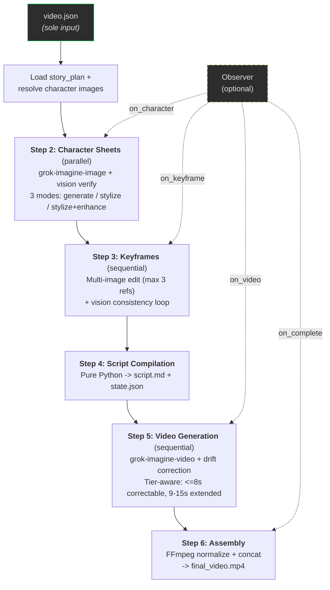
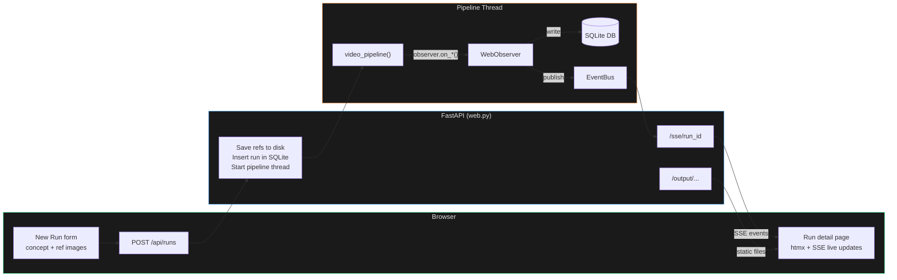
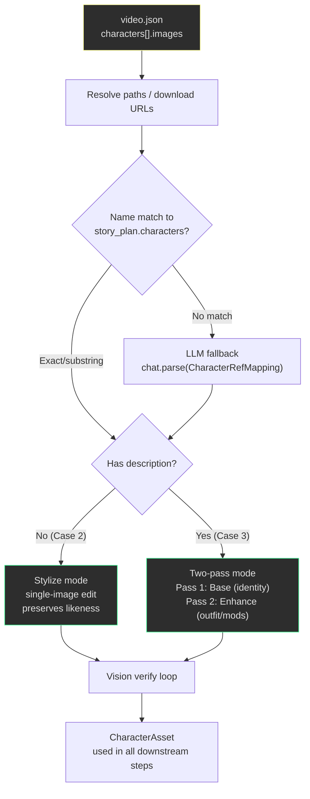
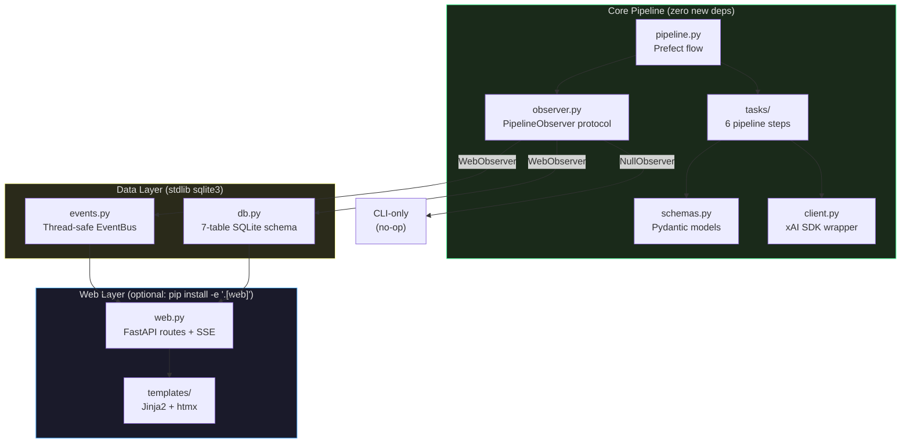
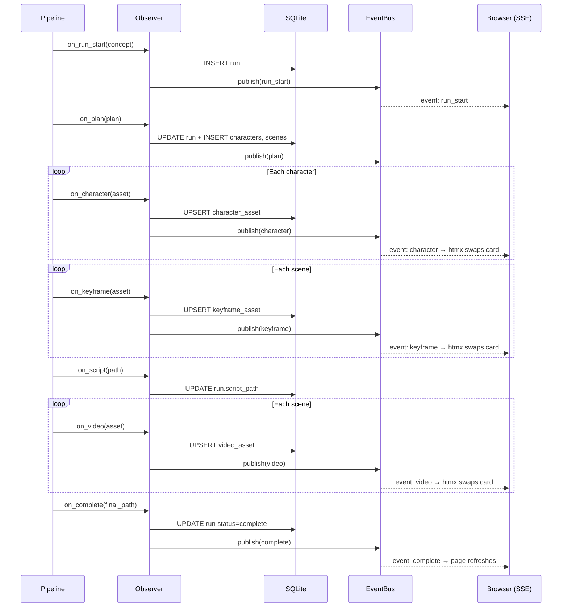
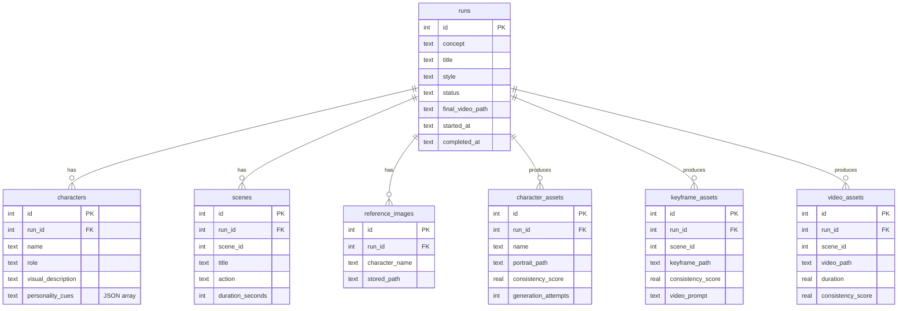

# Grok Spicy

An automated video production pipeline that turns a fully explicit `video.json` config into a multi-scene video with consistent characters. All story content (characters, scenes, prompts) is defined verbatim in the config — no LLM ideation or rewriting. Powered entirely by xAI's Grok API family and orchestrated with Prefect.

**Input:** A `video.json` file containing the full story plan, characters, scenes, and style configuration.
**Output:** A ~24-second assembled video at 720p with consistent characters across all scenes.

## Prerequisites

- **Python 3.12+**
- **FFmpeg** installed and on PATH ([download](https://ffmpeg.org/download.html)) — not needed for `--dry-run`
- **Grok API key** from [xAI](https://x.ai/) — not needed for `--dry-run`

## Quick Start

```bash
# 1. Clone the repo
git clone https://github.com/your-org/grok-spicy.git
cd grok-spicy

# 2. Create a virtual environment (recommended)
python -m venv .venv
source .venv/bin/activate        # Linux/macOS
# .venv\Scripts\activate         # Windows

# 3. Install the package
pip install -e .

# 4. Set up your API key
cp .env.example .env
# Edit .env and add your GROK_API_KEY

# 5. Edit video.json with your story plan, characters, and scenes

# 6. Run the pipeline
python -m grok_spicy
```

The pipeline takes ~5-6 minutes and costs ~$3.80 per run (2 characters, 3 scenes). Output lands in `output/runs/<timestamp>/final.mp4`.

## Pipeline Flow

The pipeline is a five-step process (Steps 2-6) orchestrated as a Prefect flow (`src/grok_spicy/pipeline.py`). Each step is a Prefect task with automatic retries, caching, and observability. **There is no LLM ideation step** — the story plan comes directly from `video.json`.


```mermaid
flowchart TD
    A["video.json<br/><i>(sole input)</i>"] --> B["Load story_plan +<br/>resolve character images"]
    B --> C["<b>Step 2: Character Sheets</b> (parallel)<br/>grok-imagine-image + vision verify<br/>3 modes: generate / stylize / stylize+enhance"]
    C --> D["<b>Step 3: Keyframes</b> (sequential)<br/>Multi-image edit (max 3 refs)<br/>+ vision consistency loop"]
    D --> E["<b>Step 4: Script Compilation</b><br/>Pure Python -> script.md + state.json"]
    E --> F["<b>Step 5: Video Generation</b> (sequential)<br/>grok-imagine-video + drift correction<br/>Tier-aware: <=8s correctable, 9-15s extended"]
    F --> G["<b>Step 6: Assembly</b><br/>FFmpeg normalize + concat<br/>-> final_video.mp4"]

    O["Observer<br/>(optional)"] -.->|on_character| C
    O -.->|on_keyframe| D
    O -.->|on_video| F
    O -.->|on_complete| G

    style A fill:#2d2d2d,stroke:#4f9,color:#e0e0e0
    style O fill:#2d2d2d,stroke:#ff9,color:#e0e0e0,stroke-dasharray: 5 5
```

**Step details:**

| Step | Task | Model(s) | Execution | Key Behavior |
|---|---|---|---|---|
| 2 | `generate_character_sheet` | `grok-imagine-image` + `grok-4-1-fast-reasoning` | **Parallel** | 3 modes: generate (text only), stylize (photo), or stylize+enhance (photo + modifications); vision verify; retry if < 0.80 |
| 3 | `compose_keyframe` | `grok-imagine-image` + `grok-4-1-fast-reasoning` | Sequential | Multi-image edit with char refs -> vision check -> fix loop (max 3x) |
| 4 | `compile_script` | None | Single call | Pure Python: `script.md` + `state.json` |
| 5 | `generate_scene_video` | `grok-imagine-video` + `grok-4-1-fast-reasoning` | Sequential | Tier-aware: <=8s correction-eligible (max 2x drift fix), 9-15s extended (retry if score < 0.50) |
| 6 | `assemble_final_video` | FFmpeg | Single call | Normalize 24fps/720p -> concatenate |

### Character Sheet Modes (Step 2)

Step 2 supports three modes based on what `characters[]` provides in `video.json`:

| Case | `images` | `description` | Behavior |
|------|----------|---------------|----------|
| 1 | empty | any | Generate portrait from `visual_description` text only |
| 2 | provided | empty | Stylize reference photo into art style (single pass) |
| 3 | provided | non-empty | **Two-pass**: base sheet from photo (identity only, no spicy traits), then enhancement pass applying `description` as modifications (clothes, marks, etc.) + spicy traits |

In Case 3, the `description` is treated as outfit/modification changes (not a full visual description). The base portrait preserves facial identity; the enhancement pass adds the specified changes on top.

### Key Design Decisions

- **Config-driven** — Everything comes from `video.json`. No LLM ideation or rewriting of your text.
- **Verbatim descriptions** — The `visual_description` from `story_plan` is used verbatim in every image prompt, never paraphrased.
- **Multi-image anchoring** — Character sheets are always passed as `image_urls[]` references, never relying on text alone.
- **Last-frame chaining** — Each scene's keyframe references the previous scene's output for visual continuity.
- **Motion-only video prompts** — Step 5 prompts describe camera and action, not appearance. The keyframe carries appearance truth.
- **Tier-aware video generation** — Scenes <=8s get drift correction loops (max 2); scenes 9-15s are extended-tier with no corrections (only regeneration if score < 0.50).
- **Vision-in-the-loop** — Every generated asset is checked by Grok Vision against reference sheets, with surgical fix prompts on failure.
- **Observer pattern** — Pipeline emits events at each step boundary. A `NullObserver` (default) is a no-op; a `WebObserver` writes to SQLite and pushes SSE events for the live dashboard.
- **Moderation resilience** — Blocked prompts are automatically reworded (max 2 attempts) while preserving scene/character/camera/style intent.
- **Pure prompt functions** — All prompt construction lives in `prompts.py` as composable pure functions, one per prompt type.

## Web Dashboard

A live-reloading web dashboard for watching pipeline runs in real time and browsing past runs. Uses htmx + SSE — zero npm, zero build step.


```mermaid
flowchart LR
    subgraph Browser
        A["New Run form<br/>concept + ref images"] --> B["POST /api/runs"]
        D["Run detail page<br/>htmx + SSE live updates"]
    end

    subgraph Server["FastAPI (web.py)"]
        B --> E["Save refs to disk<br/>Insert run in SQLite<br/>Start pipeline thread"]
        F["/sse/run_id"] -->|"SSE events"| D
        G["/output/..."] -->|"static files"| D
    end

    subgraph Pipeline["Pipeline Thread"]
        E --> H["video_pipeline()"]
        H -->|"observer.on_*()"| I["WebObserver"]
        I -->|"write"| J[("SQLite DB")]
        I -->|"publish"| K["EventBus"]
        K --> F
    end

    style Browser fill:#1a1a1a,stroke:#4f9,color:#e0e0e0
    style Server fill:#1a1a1a,stroke:#4af,color:#e0e0e0
    style Pipeline fill:#1a1a1a,stroke:#f94,color:#e0e0e0
```

### Running the Dashboard

```bash
# Install web dependencies
pip install -e ".[web]"

# Run pipeline with live dashboard
python -m grok_spicy --serve
# Dashboard at http://localhost:8420

# Browse past runs only (no pipeline)
python -m grok_spicy --web

# Custom port
python -m grok_spicy --serve --port 9000
```

### Two Servers — Don't Get Confused

When you use `--serve`, **two servers** start simultaneously:

| Server | Port | What It Is |
|---|---|---|
| Prefect temporary server | Random (e.g., 8736) | Internal workflow engine. **Not your dashboard.** |
| Dashboard (FastAPI) | **8420** (default) | The actual web UI you want. |

Prefect logs its URL first (`Starting temporary server on http://127.0.0.1:8736`), which
can be misleading. **Ignore it.** The dashboard URL is printed in a clear banner right after:

```
============================================================
  DASHBOARD: http://localhost:8420
  (ignore the Prefect server URL above — that is internal)
============================================================
```

If you open Prefect's port in a browser, you'll see `{"detail":"Not Found"}` — that's
expected. Go to **http://localhost:8420** instead (or your `--port` value).

### Verifying the Server

```bash
# Health check
curl http://localhost:8420/health
# → {"status":"ok"}

# Dashboard home page
curl http://localhost:8420/
# → HTML page
```

### Reference Images (Character Faces)

Define character reference photos in `video.json` under `characters[].images`. The pipeline resolves local paths relative to the project root and downloads URLs to a staging directory.


```mermaid
flowchart TD
    A["video.json<br/>characters[].images"] --> B["Resolve paths / download URLs"]
    B --> C{"Name match to<br/>story_plan.characters?"}
    C -->|"Exact/substring"| D{"Has description?"}
    C -->|"No match"| E["LLM fallback<br/>chat.parse(CharacterRefMapping)"]
    E --> D
    D -->|"No (Case 2)"| F["Stylize mode<br/>single-image edit<br/>preserves likeness"]
    D -->|"Yes (Case 3)"| G["Two-pass mode<br/>Pass 1: Base (identity)<br/>Pass 2: Enhance (outfit/mods)"]
    F --> H["Vision verify loop"]
    G --> H
    H --> I["CharacterAsset<br/>used in all downstream steps"]

    style A fill:#2d2d2d,stroke:#ff9,color:#e0e0e0
    style F fill:#2d2d2d,stroke:#4f9,color:#e0e0e0
    style G fill:#2d2d2d,stroke:#4f9,color:#e0e0e0
```

**How it works:**
1. Character images from `video.json` are resolved at pipeline start
2. Names are matched to `story_plan.characters` by exact match, substring, or LLM fallback
3. **Case 2** (images, no description): stylize the photo into the art style in a single pass
4. **Case 3** (images + description): two-pass — base identity from photo, then apply outfit/modification enhancements
5. Characters without references generate from `visual_description` text (Case 1)
6. The vision verification loop runs on all characters regardless of mode

## `video.json` — The Sole Input

`video.json` is the **sole input** to the pipeline. It contains everything: the story plan (characters, scenes, style), spicy modifiers, narrative constraints, and character reference images. No LLM ideation or rewriting.

### Quick Start

```bash
# Run with default ./video.json
python -m grok_spicy

# Run with alternate config
python -m grok_spicy --config path/to/video.json

# Preview all prompts without API calls
python -m grok_spicy --dry-run
```

### Schema

```json
{
  "version": "1.0",
  "spicy_mode": {
    "enabled": true,
    "enabled_modifiers": ["modifier1", "modifier2"],
    "intensity": "high",
    "global_prefix": "Prefix prepended to all prompts: ",
    "extreme_emphasis": "(optional emphasis)"
  },
  "characters": [
    {
      "id": "char_001",
      "name": "Luna",
      "description": "Enhancement spec (clothes, marks) -- applied as modifications when images present",
      "images": ["source_images/ref.jpg"],
      "spicy_traits": ["trait1", "trait2"]
    }
  ],
  "default_video": {
    "scene": "Default scene/setting description",
    "motion": "Default motion description",
    "audio_cues": "Audio atmosphere hints"
  },
  "narrative_core": {
    "restraint_rule": "Appended as INVIOLABLE RULE",
    "escalation_arc": "Appended as INVIOLABLE RULE",
    "style_directive": "Appended to character + video prompts"
  },
  "story_plan": {
    "title": "Story Title",
    "style": "Visual style prepended to every prompt",
    "aspect_ratio": "16:9",
    "color_palette": "Color description for keyframes",
    "characters": [
      {
        "name": "Luna",
        "role": "protagonist",
        "visual_description": "Exhaustive visual description used VERBATIM in every prompt",
        "personality_cues": ["adjective1", "adjective2"]
      }
    ],
    "scenes": [
      {
        "scene_id": 1,
        "title": "Scene Title",
        "description": "Narrative description (for script.md)",
        "characters_present": ["Luna"],
        "setting": "Physical environment",
        "camera": "Shot type + movement",
        "mood": "Lighting/atmosphere",
        "action": "Primary motion",
        "prompt_summary": "Concise action sentence",
        "duration_seconds": 8,
        "transition": "cut"
      }
    ]
  }
}
```

**Key rule:** `story_plan.characters[].name` must match `characters[].name` for spicy_traits, reference images, and enhancement descriptions to be merged correctly.

### Field Reference

Every field, where it's injected, and how it affects prompts:

#### Top-level

| Field | Type | Required | Description |
|---|---|---|---|
| `version` | string | yes | Schema version, currently `"1.0"` |

#### `spicy_mode` (required)

Controls whether spicy modifiers, prefix, and narrative rules are injected into prompts. When `enabled` is `false`, all spicy injection is skipped — prompts use only `story_plan` fields.

| Field | Type | Default | Where Used | Description |
|---|---|---|---|---|
| `enabled` | bool | `true` | All prompt builders | Master switch — gates all `global_prefix`, `enabled_modifiers`, `narrative_core`, and `style_directive` injection |
| `enabled_modifiers` | string[] | — | Steps 2, 3, 5 | Appended as `**SPICY MODIFIERS:**` bullet list to character, keyframe, and video prompts. De-duplicated against per-character `spicy_traits` |
| `intensity` | enum | — | Logging only | `"low"` / `"medium"` / `"high"` / `"extreme"` — logged at startup for reference but does not control prompt behavior (use `enabled_modifiers` to control what's injected) |
| `global_prefix` | string | — | Steps 2, 3, 5 | Prepended verbatim to every image/video generation prompt (e.g. `"Photorealistic, sensual: "`) |
| `extreme_emphasis` | string | `""` | **Unused** | Reserved field — defined in schema but not read by any prompt builder |

#### `characters[]` (optional)

Config-level character definitions that merge into `story_plan.characters` by name match. Provide these when you have reference photos or per-character spicy traits.

| Field | Type | Default | Where Used | Description |
|---|---|---|---|---|
| `id` | string | — | Image resolution | Unique identifier used internally to map resolved image paths back to characters |
| `name` | string | — | Name matching | Must match a `story_plan.characters[].name` exactly for traits/images/description to merge |
| `description` | string | `""` | Step 2 (Case 3) | Enhancement spec — when `images` is also provided, this triggers two-pass generation: base portrait from photo, then enhancement pass applying this text as outfit/modification changes. If `images` is empty, this field is ignored |
| `images` | string[] | `[]` | Step 2 | Reference image paths (local, resolved relative to project root) or URLs (downloaded to staging). First image used as `image_url` for stylize/enhance. Triggers Case 2 (images only) or Case 3 (images + description) |
| `spicy_traits` | string[] | `[]` | Step 2 vision checks | Merged into the matching `story_plan` character's `spicy_traits`. Appended to character portrait prompts and checked in vision verification (e.g. `["wearing red dress", "visible tattoo on left arm"]`) |

#### `default_video` (optional)

| Field | Type | Default | Where Used | Description |
|---|---|---|---|---|
| `scene` | string | `""` | **Unused** (was ideation) | Default scene/setting — was injected into LLM ideation prompts, which are now disabled. Retained for schema compatibility |
| `motion` | string | `""` | **Unused** (was ideation) | Default motion description — same as above |
| `audio_cues` | string | `""` | **Unused** (was ideation) | Audio atmosphere hints — same as above |

> **Note:** `default_video` fields were used by the now-disabled ideation step. With explicit `story_plan` scenes, all scene/motion/setting information comes from individual scene fields instead. These fields are harmless to keep but have no effect on the pipeline.

#### `narrative_core` (optional)

Narrative constraints appended to generation and vision-check prompts when `spicy_mode.enabled` is `true`.

| Field | Type | Default | Where Used | Description |
|---|---|---|---|---|
| `restraint_rule` | string | `""` | Steps 3, 5 + vision checks | Appended as `**INVIOLABLE RULES:** - **Restraint Rule**: {value}` to keyframe composition, video generation, keyframe vision check, and video vision check prompts |
| `escalation_arc` | string | `""` | Steps 3, 5 + vision checks | Appended as `**INVIOLABLE RULES:** - **Escalation Arc**: {value}` alongside `restraint_rule` to the same prompts |
| `style_directive` | string | `""` | Steps 2, 5 | Appended to character portrait prompts (generate, stylize, enhance) and video generation prompts. Not injected into keyframe or vision-check prompts |

#### `story_plan` (required)

The complete story definition. All fields are used **verbatim** — no LLM rewrites.

| Field | Type | Default | Where Used | Description |
|---|---|---|---|---|
| `title` | string | — | Script header, DB, logging | Story title — appears in `script.md` header and run metadata |
| `style` | string | — | Steps 2, 3, 5 | Visual style string prepended to every image/video prompt (the "style lock"). E.g. `"Cinematic realism with soft volumetric lighting"` |
| `aspect_ratio` | string | `"16:9"` | Step 2 (image gen) | Passed to `grok-imagine-image` as the aspect ratio parameter |
| `color_palette` | string | — | Step 3 | Injected into keyframe composition prompts as `"Color palette: {value}"` |

#### `story_plan.characters[]` (required)

| Field | Type | Where Used | Description |
|---|---|---|---|
| `name` | string | Steps 2, 3, 4, 5 | Character identifier — used everywhere. Must match `characters[].name` for trait/image merging |
| `role` | string | Script metadata | `"protagonist"` / `"antagonist"` / `"supporting"` — stored in DB and script.md |
| `visual_description` | string | Steps 2, 3 | **Frozen verbatim description** (min ~80 words recommended). Copy-pasted into every character portrait prompt and keyframe composition prompt. Never paraphrased or summarized. This is the single source of truth for appearance |
| `personality_cues` | string[] | Script metadata | 3-5 adjective/phrases for expression guidance. Stored in DB, not injected into image prompts |
| `spicy_traits` | string[] | Step 2 | Additional traits merged from `characters[].spicy_traits` by name match. Appended to portrait generation prompts and checked in vision verification |

#### `story_plan.scenes[]` (required)

Each scene produces one keyframe (Step 3) and one video clip (Step 5). Scenes are processed sequentially.

| Field | Type | Default | Where Used | Description |
|---|---|---|---|---|
| `scene_id` | int | — | All steps | Unique scene number — used to order scenes and match keyframes to videos |
| `title` | string | — | Step 3, script.md | Brief scene title (3-6 words) — injected into keyframe prompt as `"Scene: {title}"` |
| `description` | string | — | Script.md only | Narrative description (2-3 sentences). Appears only in the storyboard markdown, **not** in any image/video prompt |
| `characters_present` | string[] | Step 3 | Character names present in this scene. Their portrait refs are included as `image_urls` in the keyframe edit call. Names must match `story_plan.characters[].name` |
| `setting` | string | — | Step 3 | Physical environment, time of day, weather — injected into keyframe prompt as `"Setting: {value}"` |
| `camera` | string | — | Steps 3, 5 | Shot type + movement (e.g. `"medium shot, slow dolly forward"`) — injected into keyframe prompt as `"Camera: {value}"` and into video prompt |
| `mood` | string | — | Steps 3, 5 | Lighting/atmosphere (e.g. `"warm golden hour, soft shadows"`) — injected into keyframe prompt and video prompt |
| `action` | string | — | Steps 3, 5 | Primary motion (e.g. `"Fox leaps over fallen log"`) — injected into keyframe prompt as `"Action: {value}"` and into video prompt. For extended scenes (>8s), split on `;` into Phase 1/Phase 2 |
| `prompt_summary` | string | — | Steps 3, 5 | Concise action sentence (max ~30 words) — injected into keyframe prompt as scene description and as the main text of the video prompt |
| `duration_seconds` | int | — | Step 5 | Video duration in seconds (3-15). Determines generation tier: **3-8s** = correction-eligible (drift fix loop), **9-15s** = extended (phased prompt, retry-only on score < 0.50) |
| `transition` | string | `"cut"` | Step 6 | `"cut"` / `"crossfade"` / `"match-cut"` — used by FFmpeg assembly |

### Character Image References

Character images in `video.json` are resolved automatically:

- **Local paths** (`source_images/elena.jpg`) -- resolved relative to project root
- **URLs** (`https://...`) -- downloaded to a staging directory before the run

### Graceful Fallback

- If `video.json` is **missing** -- logs a warning, uses empty defaults (no crash, but pipeline requires `story_plan`)
- If `video.json` has **invalid JSON** -- logs a warning, uses empty defaults
- If `video.json` has **invalid schema** -- logs a warning, uses empty defaults

## Dry-Run Mode

Preview every prompt the pipeline would send -- without making API calls, spending money, or needing an API key.

```bash
# Basic dry run
python -m grok_spicy --dry-run

# Dry run with alternate config
python -m grok_spicy --dry-run --config examples/video-high.json

# Inspect the output
cat output/runs/<id>/prompts/summary.md
```

**How it works:**
- All prompt construction code runs normally -- no duplication
- API calls are replaced with mock returns (placeholder URLs, score=1.0)
- Mock data flows downstream so ALL steps execute and produce prompts
- Each prompt is written as a structured markdown file to `output/runs/<id>/prompts/{step}/{label}.md`
- A `summary.md` lists all generated prompt files
- Step 6 (assembly) is skipped entirely; Step 4 (script) runs unchanged
- Case 3 characters write prompts for both passes (base + enhance)

**Output structure:**
```
output/runs/<id>/prompts/
  step2_characters/
    Alice_generate.md              # Case 1: text-only
    Alice_vision_check.md
    Maya_stylize_base.md           # Case 3: base pass
    Maya_vision_check_base.md
    Maya_enhance.md                # Case 3: enhancement pass
    Maya_vision_check_enhance.md
  step3_keyframes/
    scene_1_compose.md
    scene_1_video_prompt.md
    scene_1_vision_check.md
  step5_videos/
    scene_1_generate.md
    scene_1_vision_check.md
    scene_1_correction_template.md
  summary.md
```

Each `.md` file contains: model name, full prompt text, image references, and API parameters.

## CLI Reference

```
python -m grok_spicy [options]
```

| Flag | Type | Default | Description |
|---|---|---|---|
| `--config` | string | `./video.json` | Path to video.json config file |
| `--output-dir` | string | `output` | Output directory |
| `--serve` | flag | `false` | Start dashboard server alongside pipeline |
| `--web` | flag | `false` | Start dashboard server only (browse past runs) |
| `--port` | int | `8420` | Dashboard server port |
| `--max-duration` | int | `15` | Max per-scene duration in seconds (3-15) |
| `--negative-prompt` | string | -- | Appended as "Avoid: TEXT" to all generation prompts |
| `--style-override` | string | -- | Replace the plan.style from config |
| `--consistency-threshold` | float | `0.80` | Vision-check threshold (0.0-1.0) |
| `--max-retries` | int | -- | Override all retry/iteration counts |
| `--dry-run` | flag | `false` | Preview all prompts without API calls (no key/FFmpeg needed) |
| `--debug` | flag | `false` | Only generate 1 scene (faster test runs) |
| `-v`, `--verbose` | flag | `false` | Enable DEBUG-level logging on the console |

**Behavior matrix:**

| Command | Pipeline | Dashboard |
|---|---|---|
| `python -m grok_spicy` | Runs (reads `./video.json`) | -- |
| `python -m grok_spicy --config path.json` | Runs with custom config | -- |
| `python -m grok_spicy --serve` | Runs | Background thread |
| `python -m grok_spicy --dry-run` | Writes prompts only | -- |
| `python -m grok_spicy --web` | -- (launch from dashboard) | Main process |

## Output Structure

```
output/runs/<run_id>/
├── characters/
│   ├── Luna_v1.jpg                    # Case 1/2: all attempts kept
│   ├── Luna_base_v1.jpg              # Case 3: base identity sheet
│   ├── Luna_enhanced_v1.jpg          # Case 3: enhanced sheet (used downstream)
│   └── Kai_v1.jpg
├── keyframes/
│   ├── scene_1_v1.jpg
│   └── scene_2_v1.jpg
├── frames/
│   ├── scene_1_first.jpg, scene_1_last.jpg
│   └── scene_2_first.jpg, scene_2_last.jpg
├── videos/
│   ├── scene_1.mp4, scene_1_c1.mp4   # Original + corrections
│   └── scene_2.mp4
├── references/                        # Copied from staging at run start
│   └── miho2.jpg
├── prompts/                           # Dry-run prompt files
├── script.md          # Human-readable storyboard
├── state.json         # Full pipeline state (resumable)
├── concat.txt         # FFmpeg concat manifest
└── final.mp4          # Assembled output
```

## Architecture


```mermaid
graph TD
    subgraph Core["Core Pipeline (zero new deps)"]
        schemas["schemas.py<br/>Pydantic models"]
        client["client.py<br/>xAI SDK wrapper"]
        tasks["tasks/<br/>6 pipeline steps"]
        pipeline["pipeline.py<br/>Prefect flow"]
        observer_mod["observer.py<br/>PipelineObserver protocol"]
    end

    subgraph Data["Data Layer (stdlib sqlite3)"]
        db["db.py<br/>7-table SQLite schema"]
        events["events.py<br/>Thread-safe EventBus"]
    end

    subgraph Web["Web Layer (optional: pip install -e '.[web]')"]
        web["web.py<br/>FastAPI routes + SSE"]
        templates["templates/<br/>Jinja2 + htmx"]
    end

    pipeline --> tasks
    tasks --> client
    tasks --> schemas
    pipeline --> observer_mod
    observer_mod -->|NullObserver| NULL["CLI-only<br/>(no-op)"]
    observer_mod -->|WebObserver| db
    observer_mod -->|WebObserver| events
    events --> web
    db --> web
    web --> templates

    style Core fill:#1a2a1a,stroke:#4f9,color:#e0e0e0
    style Data fill:#2a2a1a,stroke:#ff9,color:#e0e0e0
    style Web fill:#1a1a2a,stroke:#4af,color:#e0e0e0
```

### Observer Pattern

The pipeline calls observer methods at each step boundary. This keeps the core pipeline clean — it doesn't know or care about SQLite, SSE, or the dashboard.


```mermaid
sequenceDiagram
    participant P as Pipeline
    participant O as Observer
    participant DB as SQLite
    participant B as EventBus
    participant SSE as Browser (SSE)

    P->>O: on_run_start(concept)
    O->>DB: INSERT run
    O->>B: publish(run_start)
    B-->>SSE: event: run_start

    P->>O: on_plan(plan)
    O->>DB: UPDATE run + INSERT characters, scenes
    O->>B: publish(plan)

    loop Each character
        P->>O: on_character(asset)
        O->>DB: UPSERT character_asset
        O->>B: publish(character)
        B-->>SSE: event: character → htmx swaps card
    end

    loop Each scene
        P->>O: on_keyframe(asset)
        O->>DB: UPSERT keyframe_asset
        O->>B: publish(keyframe)
        B-->>SSE: event: keyframe → htmx swaps card
    end

    P->>O: on_script(path)
    O->>DB: UPDATE run.script_path

    loop Each scene
        P->>O: on_video(asset)
        O->>DB: UPSERT video_asset
        O->>B: publish(video)
        B-->>SSE: event: video → htmx swaps card
    end

    P->>O: on_complete(final_path)
    O->>DB: UPDATE run status=complete
    O->>B: publish(complete)
    B-->>SSE: event: complete → page refreshes
```

### SQLite Schema

Seven tables mirroring the Pydantic models:


```mermaid
erDiagram
    runs ||--o{ characters : has
    runs ||--o{ scenes : has
    runs ||--o{ reference_images : has
    runs ||--o{ character_assets : produces
    runs ||--o{ keyframe_assets : produces
    runs ||--o{ video_assets : produces

    runs {
        int id PK
        text concept
        text title
        text style
        text status
        text final_video_path
        text started_at
        text completed_at
    }

    characters {
        int id PK
        int run_id FK
        text name
        text role
        text visual_description
        text personality_cues "JSON array"
    }

    scenes {
        int id PK
        int run_id FK
        int scene_id
        text title
        text action
        int duration_seconds
    }

    reference_images {
        int id PK
        int run_id FK
        text character_name
        text stored_path
    }

    character_assets {
        int id PK
        int run_id FK
        text name
        text portrait_path
        real consistency_score
        int generation_attempts
    }

    keyframe_assets {
        int id PK
        int run_id FK
        int scene_id
        text keyframe_path
        real consistency_score
        text video_prompt
    }

    video_assets {
        int id PK
        int run_id FK
        int scene_id
        text video_path
        real duration
        real consistency_score
    }
```

Status progression: `pending` → `characters` → `keyframes` → `script` → `videos` → `assembly` → `complete` (or `failed`).

## Development Setup

```bash
# Install all dependencies (runtime + dev tools + web dashboard)
pip install -r requirements-dev.txt
pip install -e ".[web]"
```

## Linting & Formatting

All tool configuration lives in `pyproject.toml`. CI runs these checks on every push and pull request to `main`.

```bash
# Auto-fix formatting
python -m isort .
python -m black .

# Check only (CI mode — exits non-zero on violations)
python -m isort . --check-only --diff
python -m black . --check --diff
python -m ruff check .
python -m mypy src/grok_spicy/
```

| Tool | Purpose | Config |
|---|---|---|
| **black** | Code formatting | line-length 88, Python 3.12 |
| **isort** | Import sorting | `profile = "black"`, first-party = `grok_spicy` |
| **ruff** | Fast linter | Rules: E, F, W, I, UP, B, SIM |
| **mypy** | Static type checking | `ignore_missing_imports`, `check_untyped_defs` |

## Testing

```bash
# Run all unit tests (no server, no API key needed)
python -m pytest tests/ --tb=short -q

# Run a specific test file
python -m pytest tests/test_web.py -v

# Run live server integration tests (starts real uvicorn)
python -m pytest tests/test_web_live.py -v -m live

# Run everything including live tests
python -m pytest tests/ -v -m "live or not live"
```

### Test Structure

```
tests/
├── README.md                 # Detailed testing guide + troubleshooting
├── test_schemas.py           # 5 tests — Pydantic models, JSON round-trips, field bounds
├── test_client.py            # 2 tests — Constants, base64 encoding
├── test_db.py                # 25 tests — SQLite schema, CRUD, upserts, JSON fields
├── test_events.py            # 9 tests — EventBus subscribe/publish, queue ordering
├── test_observer.py          # 10 tests — NullObserver, WebObserver, error resilience
├── test_pipeline_helpers.py  # 8 tests — _notify(), _match_character_refs()
├── test_pipeline_config.py   # 13 tests — PipelineConfig defaults, overrides, bounds
├── test_video_config.py      # 23 tests — VideoConfig schema, loader, caching, prompt builder
├── test_prompts.py           # 22 tests — All prompt builder functions
├── test_script.py            # Script compilation (markdown storyboard generation)
├── test_cli.py               # 4 tests — config-only pipeline, missing story_plan, dry-run, defaults
├── test_web.py               # 22 tests — HTTP routes, JSON API, uploads, health, static
└── test_web_live.py          # 5 tests — Real uvicorn server (marked @pytest.mark.live)
```

Unit tests (everything except `test_web_live.py`) require no server, no API key, and no
network access. They run in CI on every push. Live tests start a real uvicorn server on a
random port and need `pip install -e ".[web]"`.

Tests use `pythonpath = ["src"]` configured in `pyproject.toml`, so imports work without
installing the package. See [`tests/README.md`](tests/README.md) for the full testing guide,
including manual server testing and common issues (port confusion, etc.).

## Logging

Logs are always written to `output/grok_spicy.log` at DEBUG level — every LLM prompt,
API call, decision, and score is captured.

Console output defaults to INFO level. Use `-v` for full DEBUG output:

```bash
python -m grok_spicy --serve -v
```

All LLM prompts (character generation, keyframe composition, video generation,
vision checks) are logged **in full** at INFO level — visible on console without `-v`.

## CI Pipeline

GitHub Actions workflow at `.github/workflows/ci.yml` runs automatically on push and pull requests to `main`:

| Job | Steps |
|---|---|
| **lint** | isort check, black check, ruff check, mypy type check |
| **test** | Install package, run pytest |

## Project Structure

```
grok-spicy/
├── .github/workflows/ci.yml       # CI pipeline
├── CLAUDE.md                       # AI assistant context
├── pyproject.toml                  # Package config + tool settings
├── requirements.txt                # Runtime dependencies
├── requirements-dev.txt            # Dev dependencies (linting, testing)
├── .env.example                    # Environment variable template
├── .gitignore
├── video.json                      # THE sole pipeline input (edit this)
├── examples/                       # Example video.json configs
├── src/
│   └── grok_spicy/
│       ├── __init__.py             # Package version
│       ├── __main__.py             # CLI entry point (--config, --serve, --web, --dry-run)
│       ├── schemas.py              # Pydantic models (StoryPlan, VideoConfig, CharacterAsset, etc.)
│       ├── config.py               # video.json loader with caching + fallback
│       ├── client.py               # xAI SDK wrapper + helpers
│       ├── dry_run.py              # Dry-run helpers (write prompts to markdown)
│       ├── prompts.py              # Pure prompt builder functions (all pipeline prompts)
│       ├── pipeline.py             # Prefect flow (main orchestration)
│       ├── db.py                   # SQLite schema + CRUD
│       ├── events.py               # Thread-safe EventBus
│       ├── observer.py             # PipelineObserver protocol + implementations
│       ├── web.py                  # FastAPI dashboard app
│       ├── templates/
│       │   ├── base.html           # Layout shell (htmx + dark theme)
│       │   ├── index.html          # Run list
│       │   ├── new_run.html        # New run form + image upload
│       │   └── run.html            # Live-updating run detail
│       └── tasks/
│           ├── ideation.py         # (UNUSED -- kept for reference)
│           ├── describe_ref.py     # (UNUSED -- was Step 0 for ref photo analysis)
│           ├── characters.py       # Step 2: generate/stylize/enhance + verify portraits
│           ├── keyframes.py        # Step 3: multi-image scene composition
│           ├── script.py           # Step 4: markdown storyboard
│           ├── video.py            # Step 5: image -> video + corrections (tier-aware)
│           └── assembly.py         # Step 6: FFmpeg concat
├── tests/
│   ├── README.md               # Testing guide + troubleshooting
│   ├── test_schemas.py         # Pydantic model validation
│   ├── test_client.py          # SDK wrapper helpers
│   ├── test_db.py              # SQLite CRUD operations
│   ├── test_events.py          # EventBus pub/sub
│   ├── test_observer.py        # Observer pattern
│   ├── test_pipeline_helpers.py # Pipeline utility functions
│   ├── test_pipeline_config.py # PipelineConfig unit tests
│   ├── test_dry_run.py         # Dry-run prompt writer
│   ├── test_video_config.py    # VideoConfig, config loader, prompt builder
│   ├── test_prompts.py         # Prompt builder functions
│   ├── test_cli.py             # CLI argument parsing
│   ├── test_web.py             # Dashboard routes (unit)
│   └── test_web_live.py        # Dashboard routes (live server)
└── docs/features/                  # Feature cards (numbered)
```

## API Models Used

| Model | Purpose | Used In |
|---|---|---|
| `grok-4-1-fast-non-reasoning` | Structured output (CharacterRefMapping) | Ref matching |
| `grok-4-1-fast-reasoning` | Vision checks (consistency scoring) | Steps 2, 3, 5 |
| `grok-imagine-image` | Image generation + editing + stylization | Steps 2, 3 |
| `grok-imagine-video` | Video generation + editing (drift correction) | Step 5 |

## Cost & Performance

| Metric | Value |
|---|---|
| Cost per run | ~$3.80 |
| Runtime | ~5-6 minutes |
| Output duration | ~24 seconds |
| Resolution | 720p, 16:9 |
| Characters | 2 max per scene |
| Scenes | 3-5 |
