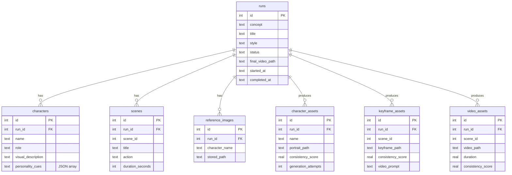

# Grok Spicy

An automated video production pipeline that turns a short text concept into a multi-scene video with visually consistent characters. Powered entirely by xAI's Grok API family and orchestrated with Prefect.

**Input:** `"A curious fox meets a wise owl in an enchanted autumn forest"`
**Output:** A ~24-second assembled video at 720p with consistent characters across all scenes.

## Prerequisites

- **Python 3.12+**
- **FFmpeg** installed and on PATH ([download](https://ffmpeg.org/download.html))
- **Grok API key** from [xAI](https://x.ai/)

## Quick Start

```bash
# 1. Clone the repo
git clone https://github.com/your-org/grok-spicy.git
cd grok-spicy

# 2. Create a virtual environment (recommended)
python -m venv .venv
source .venv/bin/activate        # Linux/macOS
# .venv\Scripts\activate         # Windows

# 3. Install the package
pip install -e .

# 4. Set up your API key
cp .env.example .env
# Edit .env and add your GROK_API_KEY

# 5. Run the pipeline
python -m grok_spicy "A curious fox meets a wise owl in an enchanted autumn forest"
```

The pipeline takes ~5-6 minutes and costs ~$3.80 per run (2 characters, 3 scenes). Output lands in `output/final_video.mp4`.

## Pipeline Flow

The pipeline is a six-step process orchestrated as a Prefect flow (`src/grok_spicy/pipeline.py`). Each step is a Prefect task with automatic retries, caching, and observability.


**Step details:**

| Step | Task | Model(s) | Execution | Key Behavior |
|---|---|---|---|---|
| 1 | `plan_story` | `grok-4-1-fast-non-reasoning` | Single call | Structured output → `StoryPlan` with frozen 80+ word character descriptions |
| 2 | `generate_character_sheet` | `grok-imagine-image` + `grok-4-1-fast-reasoning` | **Parallel** | Generate/stylize → vision verify → retry if < 0.80 (max 3x) |
| 3 | `compose_keyframe` | `grok-imagine-image` + `grok-4-1-fast-reasoning` | Sequential | Multi-image edit with char refs → vision check → fix loop (max 3x) |
| 4 | `compile_script` | None | Single call | Pure Python: `script.md` + `state.json` |
| 5 | `generate_scene_video` | `grok-imagine-video` + `grok-4-1-fast-reasoning` | Sequential | Image→video → frame extract → drift check → correction (max 2x) |
| 6 | `assemble_final_video` | FFmpeg | Single call | Normalize 24fps/720p → concatenate |

### Key Design Decisions

- **Frozen descriptions** — The `visual_description` from Step 1 is never paraphrased. The exact same string is used in every image prompt.
- **Multi-image anchoring** — Character sheets are always passed as `image_urls[]` references, never relying on text alone.
- **Last-frame chaining** — Each scene's keyframe references the previous scene's output for visual continuity.
- **Motion-only video prompts** — Step 5 prompts describe camera and action, not appearance. The keyframe carries appearance truth.
- **Vision-in-the-loop** — Every generated asset is checked by Grok Vision against reference sheets, with surgical fix prompts on failure.
- **Observer pattern** — Pipeline emits events at each step boundary. A `NullObserver` (default) is a no-op; a `WebObserver` writes to SQLite and pushes SSE events for the live dashboard.

## Web Dashboard

A live-reloading web dashboard for watching pipeline runs in real time and browsing past runs. Uses htmx + SSE — zero npm, zero build step.


### Running the Dashboard

```bash
# Install web dependencies
pip install -e ".[web]"

# Run pipeline with live dashboard
python -m grok_spicy "A fox and owl adventure" --serve
# Dashboard at http://localhost:8420

# Browse past runs only (no pipeline)
python -m grok_spicy --web

# Custom port
python -m grok_spicy "concept" --serve --port 9000
```

### Reference Images (Character Faces)

Upload photos of real people or character art. The pipeline will stylize them into the art style while preserving facial likeness.

```bash
# Via CLI
python -m grok_spicy "A spy thriller in Tokyo" \
    --ref "Alex=photos/alex.jpg" \
    --ref "Maya=photos/maya.jpg" \
    --serve

# Via dashboard: click "+ New Run", fill in concept, upload images
```


**How it works:**
1. Names are injected as hints into the ideation prompt so Grok uses them directly
2. If exact name match fails, an LLM call maps uploaded labels to generated character names
3. For matched characters, Step 2 uses `image_url` (single-image edit) to stylize the photo into the art style
4. Characters without references generate from scratch as before
5. The vision verification loop runs on all characters regardless of source

## CLI Reference

```
python -m grok_spicy [concept] [options]
```

| Flag | Type | Default | Description |
|---|---|---|---|
| `concept` | positional | — | Story concept (1-2 sentences) |
| `--output-dir` | string | `output` | Output directory |
| `--serve` | flag | `false` | Start dashboard server alongside pipeline |
| `--web` | flag | `false` | Start dashboard server only (browse past runs) |
| `--port` | int | `8420` | Dashboard server port |
| `--ref` | `NAME=PATH` | — | Character reference image (repeatable) |

**Behavior matrix:**

| Command | Pipeline | Dashboard |
|---|---|---|
| `python -m grok_spicy "concept"` | Runs | — |
| `python -m grok_spicy "concept" --serve` | Runs | Background thread |
| `python -m grok_spicy "concept" --ref "Alex=photo.jpg"` | Runs with refs | — |
| `python -m grok_spicy --web` | — (launch from dashboard) | Main process |

## Output Structure

```
output/
├── character_sheets/
│   ├── Ember_v1.jpg, Ember_v2.jpg    # All attempts kept
│   └── Sage_v1.jpg
├── keyframes/
│   ├── scene_1_v1.jpg, scene_1_v2.jpg
│   └── scene_2_v1.jpg
├── frames/
│   ├── scene_1_first.jpg, scene_1_last.jpg
│   └── scene_2_first.jpg, scene_2_last.jpg
├── videos/
│   ├── scene_1.mp4, scene_1_c1.mp4   # Original + corrections
│   └── scene_2.mp4
├── references/                        # User-uploaded reference images
│   └── 1_Alex.jpg
├── script.md          # Human-readable storyboard
├── state.json         # Full pipeline state (resumable)
├── grok_spicy.db      # SQLite database (when using --serve/--web)
└── final_video.mp4    # Assembled output
```

## Architecture


### Observer Pattern

The pipeline calls observer methods at each step boundary. This keeps the core pipeline clean — it doesn't know or care about SQLite, SSE, or the dashboard.

```mermaid
sequenceDiagram
    participant P as Pipeline
    participant O as Observer
    participant DB as SQLite
    participant B as EventBus
    participant SSE as Browser (SSE)

    P->>O: on_run_start(concept)
    O->>DB: INSERT run
    O->>B: publish(run_start)
    B-->>SSE: event: run_start

    P->>O: on_plan(plan)
    O->>DB: UPDATE run + INSERT characters, scenes
    O->>B: publish(plan)

    loop Each character
        P->>O: on_character(asset)
        O->>DB: UPSERT character_asset
        O->>B: publish(character)
        B-->>SSE: event: character → htmx swaps card
    end

    loop Each scene
        P->>O: on_keyframe(asset)
        O->>DB: UPSERT keyframe_asset
        O->>B: publish(keyframe)
        B-->>SSE: event: keyframe → htmx swaps card
    end

    P->>O: on_script(path)
    O->>DB: UPDATE run.script_path

    loop Each scene
        P->>O: on_video(asset)
        O->>DB: UPSERT video_asset
        O->>B: publish(video)
        B-->>SSE: event: video → htmx swaps card
    end

    P->>O: on_complete(final_path)
    O->>DB: UPDATE run status=complete
    O->>B: publish(complete)
    B-->>SSE: event: complete → page refreshes
```



### SQLite Schema

Seven tables mirroring the Pydantic models:



Status progression: `pending` → `ideation` → `characters` → `keyframes` → `script` → `videos` → `assembly` → `complete` (or `failed`).

## Development Setup

```bash
# Install all dependencies (runtime + dev tools + web dashboard)
pip install -r requirements-dev.txt
pip install -e ".[web]"
```

## Linting & Formatting

All tool configuration lives in `pyproject.toml`. CI runs these checks on every push and pull request to `main`.

```bash
# Auto-fix formatting
python -m isort .
python -m black .

# Check only (CI mode — exits non-zero on violations)
python -m isort . --check-only --diff
python -m black . --check --diff
python -m ruff check .
python -m mypy src/grok_spicy/
```

| Tool | Purpose | Config |
|---|---|---|
| **black** | Code formatting | line-length 88, Python 3.12 |
| **isort** | Import sorting | `profile = "black"`, first-party = `grok_spicy` |
| **ruff** | Fast linter | Rules: E, F, W, I, UP, B, SIM |
| **mypy** | Static type checking | `ignore_missing_imports`, `check_untyped_defs` |

## Testing

```bash
# Run all tests
python -m pytest tests/ --tb=short -q

# Run a specific test file
python -m pytest tests/test_schemas.py -v

# Run with verbose output
python -m pytest tests/ -v --tb=long

# Run tests matching a pattern
python -m pytest tests/ -k "test_round_trip"
```

### Test Structure

```
tests/
├── test_schemas.py    # Pydantic model validation, JSON round-trips, field bounds
└── test_client.py     # Constants verification, base64 encoding helper
```

**`test_schemas.py`** covers:
- `StoryPlan.model_json_schema()` produces valid JSON Schema
- `StoryPlan` and `PipelineState` round-trip through JSON serialization
- `ConsistencyScore` field bounds (0.0-1.0)
- `Scene.duration_seconds` bounds (3-15)

**`test_client.py`** covers:
- All pipeline constants match expected values
- `to_base64()` correctly encodes file contents

Tests use `pythonpath = ["src"]` configured in `pyproject.toml`, so imports work without installing the package.

## CI Pipeline

GitHub Actions workflow at `.github/workflows/ci.yml` runs automatically on push and pull requests to `main`:

| Job | Steps |
|---|---|
| **lint** | isort check, black check, ruff check, mypy type check |
| **test** | Install package, run pytest |

## Project Structure

```
grok-spicy/
├── .github/workflows/ci.yml       # CI pipeline
├── CLAUDE.md                       # AI assistant context
├── pyproject.toml                  # Package config + tool settings
├── requirements.txt                # Runtime dependencies
├── requirements-dev.txt            # Dev dependencies (linting, testing)
├── .env.example                    # Environment variable template
├── .gitignore
├── src/
│   └── grok_spicy/
│       ├── __init__.py             # Package version
│       ├── __main__.py             # CLI entry point (--serve, --web, --ref)
│       ├── schemas.py              # Pydantic models (data contracts)
│       ├── client.py               # xAI SDK wrapper + helpers
│       ├── pipeline.py             # Prefect flow (main orchestration)
│       ├── db.py                   # SQLite schema + CRUD
│       ├── events.py               # Thread-safe EventBus
│       ├── observer.py             # PipelineObserver protocol + implementations
│       ├── web.py                  # FastAPI dashboard app
│       ├── templates/
│       │   ├── base.html           # Layout shell (htmx + dark theme)
│       │   ├── index.html          # Run list
│       │   ├── new_run.html        # New run form + image upload
│       │   └── run.html            # Live-updating run detail
│       └── tasks/
│           ├── ideation.py         # Step 1: concept → StoryPlan
│           ├── characters.py       # Step 2: generate/stylize + verify portraits
│           ├── keyframes.py        # Step 3: multi-image scene composition
│           ├── script.py           # Step 4: markdown storyboard
│           ├── video.py            # Step 5: image → video + corrections
│           └── assembly.py         # Step 6: FFmpeg concat
├── tests/
│   ├── test_schemas.py
│   └── test_client.py
└── docs/features/                  # Feature cards (numbered)
```

## API Models Used

| Model | Purpose | Used In |
|---|---|---|
| `grok-4-1-fast-non-reasoning` | Structured output (StoryPlan, CharacterRefMapping) | Steps 1, ref matching |
| `grok-4-1-fast-reasoning` | Vision checks (consistency scoring) | Steps 2, 3, 5 |
| `grok-imagine-image` | Image generation + editing + stylization | Steps 2, 3 |
| `grok-imagine-video` | Video generation + editing | Step 5 |

## Cost & Performance

| Metric | Value |
|---|---|
| Cost per run | ~$3.80 |
| Runtime | ~5-6 minutes |
| Output duration | ~24 seconds |
| Resolution | 720p, 16:9 |
| Characters | 2 max per scene |
| Scenes | 3-5 |
