# Grok Spicy

An automated video production pipeline that turns a short text concept into a multi-scene video with visually consistent characters. Powered entirely by xAI's Grok API family and orchestrated with Prefect.

**Input:** `"A curious fox meets a wise owl in an enchanted autumn forest"`
**Output:** A ~24-second assembled video at 720p with consistent characters across all scenes.

## Prerequisites

- **Python 3.12+**
- **FFmpeg** installed and on PATH ([download](https://ffmpeg.org/download.html))
- **Grok API key** from [xAI](https://x.ai/)

## Quick Start

```bash
# 1. Clone the repo
git clone https://github.com/your-org/grok-spicy.git
cd grok-spicy

# 2. Create a virtual environment (recommended)
python -m venv .venv
source .venv/bin/activate        # Linux/macOS
# .venv\Scripts\activate         # Windows

# 3. Install the package
pip install -e .

# 4. Set up your API key
cp .env.example .env
# Edit .env and add your GROK_API_KEY

# 5. Run the pipeline
python -m grok_spicy "A curious fox meets a wise owl in an enchanted autumn forest"
```

The pipeline takes ~5-6 minutes and costs ~$3.80 per run (2 characters, 3 scenes). Output lands in `output/final_video.mp4`.

## Pipeline Flow

The pipeline is a six-step process orchestrated as a Prefect flow (`src/grok_spicy/pipeline.py`). Each step is a Prefect task with automatic retries, caching, and observability.


**Step details:**

| Step | Task | Model(s) | Execution | Key Behavior |
|---|---|---|---|---|
| 1 | `plan_story` | `grok-4-1-fast-non-reasoning` | Single call | Structured output → `StoryPlan` with frozen 80+ word character descriptions |
| 2 | `generate_character_sheet` | `grok-imagine-image` + `grok-4-1-fast-reasoning` | **Parallel** | Generate/stylize → vision verify → retry if < 0.80 (max 3x) |
| 3 | `compose_keyframe` | `grok-imagine-image` + `grok-4-1-fast-reasoning` | Sequential | Multi-image edit with char refs → vision check → fix loop (max 3x) |
| 4 | `compile_script` | None | Single call | Pure Python: `script.md` + `state.json` |
| 5 | `generate_scene_video` | `grok-imagine-video` + `grok-4-1-fast-reasoning` | Sequential | Image→video → frame extract → drift check → correction (max 2x) |
| 6 | `assemble_final_video` | FFmpeg | Single call | Normalize 24fps/720p → concatenate |

### Key Design Decisions

- **Frozen descriptions** — The `visual_description` from Step 1 is never paraphrased. The exact same string is used in every image prompt.
- **Multi-image anchoring** — Character sheets are always passed as `image_urls[]` references, never relying on text alone.
- **Last-frame chaining** — Each scene's keyframe references the previous scene's output for visual continuity.
- **Motion-only video prompts** — Step 5 prompts describe camera and action, not appearance. The keyframe carries appearance truth.
- **Vision-in-the-loop** — Every generated asset is checked by Grok Vision against reference sheets, with surgical fix prompts on failure.
- **Observer pattern** — Pipeline emits events at each step boundary. A `NullObserver` (default) is a no-op; a `WebObserver` writes to SQLite and pushes SSE events for the live dashboard.

## Web Dashboard

A live-reloading web dashboard for watching pipeline runs in real time and browsing past runs. Uses htmx + SSE — zero npm, zero build step.


### Running the Dashboard

```bash
# Install web dependencies
pip install -e ".[web]"

# Run pipeline with live dashboard
python -m grok_spicy "A fox and owl adventure" --serve
# Dashboard at http://localhost:8420

# Browse past runs only (no pipeline)
python -m grok_spicy --web

# Custom port
python -m grok_spicy "concept" --serve --port 9000
```

### Two Servers — Don't Get Confused

When you use `--serve`, **two servers** start simultaneously:

| Server | Port | What It Is |
|---|---|---|
| Prefect temporary server | Random (e.g., 8736) | Internal workflow engine. **Not your dashboard.** |
| Dashboard (FastAPI) | **8420** (default) | The actual web UI you want. |

Prefect logs its URL first (`Starting temporary server on http://127.0.0.1:8736`), which
can be misleading. **Ignore it.** The dashboard URL is printed in a clear banner right after:

```
============================================================
  DASHBOARD: http://localhost:8420
  (ignore the Prefect server URL above — that is internal)
============================================================
```

If you open Prefect's port in a browser, you'll see `{"detail":"Not Found"}` — that's
expected. Go to **http://localhost:8420** instead (or your `--port` value).

### Verifying the Server

```bash
# Health check
curl http://localhost:8420/health
# → {"status":"ok"}

# Dashboard home page
curl http://localhost:8420/
# → HTML page
```

### Reference Images (Character Faces)

Upload photos of real people or character art. The pipeline will stylize them into the art style while preserving facial likeness.

```bash
# Via CLI
python -m grok_spicy "A spy thriller in Tokyo" \
    --ref "Alex=photos/alex.jpg" \
    --ref "Maya=photos/maya.jpg" \
    --serve

# Via dashboard: click "+ New Run", fill in concept, upload images
```


**How it works:**
1. Names are injected as hints into the ideation prompt so Grok uses them directly
2. If exact name match fails, an LLM call maps uploaded labels to generated character names
3. For matched characters, Step 2 uses `image_url` (single-image edit) to stylize the photo into the art style
4. Characters without references generate from scratch as before
5. The vision verification loop runs on all characters regardless of source

## Spicy Mode

Spicy mode enables adult-themed content generation controlled entirely through a `video.json` configuration file. No code changes needed -- just edit the JSON and run.

### Quick Start

```bash
# Run with default video.json in project root
python -m grok_spicy "A romantic encounter" --spicy

# Run with a specific config file
python -m grok_spicy "A romantic encounter" --spicy --config examples/video-extreme.json

# Combine with other flags
python -m grok_spicy "A romantic encounter" --spicy --serve --ref "Elena=photos/elena.jpg"
```

### How It Works

When `--spicy` is passed, the pipeline loads `video.json` and weaves it into every step:


1. **Ideation** -- the concept is augmented with a full spicy prompt built from config characters, modifiers, and scene defaults
2. **Character enrichment** -- plan characters matching config names get spicy traits and global modifiers appended to their `visual_description`
3. **Keyframe composition** -- enabled modifiers are injected into every keyframe and video prompt
4. **Video generation** -- the `global_prefix` is prepended to video generation prompts
5. **Image references** -- character images from the config (URLs or local paths) are resolved and merged into the pipeline's reference image system

### `video.json` Schema

```json
{
  "version": "1.0",
  "spicy_mode": {
    "enabled_modifiers": ["modifier1", "modifier2"],
    "intensity": "high",
    "global_prefix": "Prefix prepended to all prompts: "
  },
  "characters": [
    {
      "id": "char_001",
      "name": "Luna",
      "description": "Full visual description used verbatim in prompts",
      "images": ["path/to/ref.jpg", "https://example.com/ref.png"],
      "spicy_traits": ["trait1", "trait2"]
    }
  ],
  "default_video": {
    "scene": "Default scene description when none specified",
    "motion": "Default camera/motion instructions",
    "audio_cues": "Audio atmosphere hints"
  }
}
```

| Field | Type | Required | Description |
|---|---|---|---|
| `version` | string | Yes | Schema version (currently `"1.0"`) |
| `spicy_mode.enabled_modifiers` | string[] | Yes | Prompt modifiers injected into every generation |
| `spicy_mode.intensity` | enum | Yes | `low` / `medium` / `high` / `extreme` -- controls how many modifiers are used |
| `spicy_mode.global_prefix` | string | Yes | Text prepended to all video prompts |
| `characters` | object[] | Yes | Array of 0 or more character definitions |
| `characters[].id` | string | Yes | Unique identifier (e.g. `"char_001"`) |
| `characters[].name` | string | Yes | Display name -- must match character names in story for trait enrichment |
| `characters[].description` | string | Yes | Full visual description used verbatim in prompts |
| `characters[].images` | string[] | No | Reference image URLs or local paths (relative to project root) |
| `characters[].spicy_traits` | string[] | No | Per-character modifiers appended to prompts |
| `default_video.scene` | string | No | Fallback scene when none is specified |
| `default_video.motion` | string | No | Default camera/motion instructions |
| `default_video.audio_cues` | string | No | Audio atmosphere hints (informational) |

### Intensity Levels

Intensity controls how many `enabled_modifiers` are actually used:

| Intensity | Modifiers Used | Extra Behavior |
|---|---|---|
| `low` | First 1 only | Subtle, minimal enhancement |
| `medium` | First 2 only | Moderate enhancement |
| `high` | All modifiers | Full enhancement |
| `extreme` | All modifiers | Adds `(extreme detail, maximum realism)` emphasis |

### Character Count Logic

The prompt builder adapts based on how many characters are defined:

| Characters | Prompt Strategy |
|---|---|
| **0** | Scene/atmosphere only -- uses `default_video.scene` + `motion` + modifiers |
| **1** | Single-focus -- character description + traits + scene + modifiers |
| **2+** | Interaction-focused -- combines all descriptions with "interacting with" + all traits |

### Character Image References

Character images in `video.json` are resolved automatically:

- **URLs** (`https://...`) -- downloaded and cached to `output/references/`
- **Local paths** (`references/elena.jpg`) -- resolved relative to project root

Config images are **additive** to `--ref` images. If a character has both a config image and a `--ref` image, the `--ref` image takes priority.

### Graceful Fallback

- If `video.json` is **missing** -- logs a warning, uses empty defaults (no crash)
- If `video.json` has **invalid JSON** -- logs a warning, uses empty defaults
- If `video.json` has **invalid schema** -- logs a warning, uses empty defaults
- Without `--spicy` -- the config file is completely ignored, pipeline runs normally

### Example Configurations

Seven example configs are provided in `examples/`:

| File | Intensity | Characters | Use Case |
|---|---|---|---|
| [`video-low.json`](examples/video-low.json) | `low` | 2 (Sophia, Marcus) | Romantic/tasteful -- candlelit dinner |
| [`video-medium.json`](examples/video-medium.json) | `medium` | 2 (Ivy, Cole) | Sensual/artistic -- rainy afternoon loft |
| [`video-high.json`](examples/video-high.json) | `high` | 2 (Luna, Kai) | Explicit -- dimly lit bedroom |
| [`video-extreme.json`](examples/video-extreme.json) | `extreme` | 2 (Valentina, Dante) | Maximum detail -- penthouse suite |
| [`video-solo.json`](examples/video-solo.json) | `high` | 1 (Aria) | Solo performance -- sunlit bedroom |
| [`video-scene-only.json`](examples/video-scene-only.json) | `medium` | 0 | Atmospheric/cinematic -- abandoned hotel |
| [`video-with-images.json`](examples/video-with-images.json) | `high` | 2 (Elena, Rafael) | Characters with reference images |

```bash
# Try different intensities
python -m grok_spicy "A romantic evening" --spicy --config examples/video-low.json
python -m grok_spicy "A passionate encounter" --spicy --config examples/video-extreme.json

# Solo character
python -m grok_spicy "A morning ritual" --spicy --config examples/video-solo.json

# Pure atmosphere, no characters
python -m grok_spicy "An abandoned place" --spicy --config examples/video-scene-only.json

# With reference photos
python -m grok_spicy "A summer romance" --spicy --config examples/video-with-images.json
```

### Creating Your Own Config

1. Copy any example from `examples/` to `video.json` (or any path)
2. Edit characters, descriptions, traits, and scene defaults
3. Choose an intensity level
4. Run with `--spicy` (and optionally `--config your-file.json`)

The config is validated on load using Pydantic. If anything is wrong, you'll get a clear error message in the logs and the pipeline falls back to defaults.

## CLI Reference

```
python -m grok_spicy [concept] [options]
```

| Flag | Type | Default | Description |
|---|---|---|---|
| `concept` | positional | -- | Story concept (1-2 sentences) |
| `--prompt-file` | string | -- | Read concept(s) from a text file (one per line) |
| `--output-dir` | string | `output` | Output directory |
| `--serve` | flag | `false` | Start dashboard server alongside pipeline |
| `--web` | flag | `false` | Start dashboard server only (browse past runs) |
| `--port` | int | `8420` | Dashboard server port |
| `--ref` | `NAME=PATH` | -- | Character reference image (repeatable) |
| `--spicy` | flag | `false` | Enable spicy mode using `video.json` configuration |
| `--config` | string | `./video.json` | Path to video.json config file (used with `--spicy`) |
| `--script` | string | -- | Path to a pre-built StoryPlan JSON (skips ideation) |
| `--max-duration` | int | `15` | Max per-scene duration in seconds (3-15) |
| `--negative-prompt` | string | -- | Appended as "Avoid: TEXT" to all generation prompts |
| `--style-override` | string | -- | Replace the LLM-generated plan.style |
| `--consistency-threshold` | float | `0.80` | Vision-check threshold (0.0-1.0) |
| `--max-retries` | int | -- | Override all retry/iteration counts |
| `--debug` | flag | `false` | Only generate 1 scene (faster test runs) |
| `-v`, `--verbose` | flag | `false` | Enable DEBUG-level logging on the console |

**Behavior matrix:**

| Command | Pipeline | Dashboard | Spicy |
|---|---|---|---|
| `python -m grok_spicy "concept"` | Runs | -- | -- |
| `python -m grok_spicy "concept" --spicy` | Runs | -- | Uses `./video.json` |
| `python -m grok_spicy "concept" --spicy --config path.json` | Runs | -- | Uses custom config |
| `python -m grok_spicy "concept" --serve` | Runs | Background thread | -- |
| `python -m grok_spicy "concept" --ref "Alex=photo.jpg"` | Runs with refs | -- | -- |
| `python -m grok_spicy --web` | -- (launch from dashboard) | Main process | -- |

## Output Structure

```
output/
├── character_sheets/
│   ├── Ember_v1.jpg, Ember_v2.jpg    # All attempts kept
│   └── Sage_v1.jpg
├── keyframes/
│   ├── scene_1_v1.jpg, scene_1_v2.jpg
│   └── scene_2_v1.jpg
├── frames/
│   ├── scene_1_first.jpg, scene_1_last.jpg
│   └── scene_2_first.jpg, scene_2_last.jpg
├── videos/
│   ├── scene_1.mp4, scene_1_c1.mp4   # Original + corrections
│   └── scene_2.mp4
├── references/                        # User-uploaded reference images
│   └── 1_Alex.jpg
├── script.md          # Human-readable storyboard
├── state.json         # Full pipeline state (resumable)
├── grok_spicy.db      # SQLite database (when using --serve/--web)
└── final_video.mp4    # Assembled output
```

## Architecture


### Observer Pattern

The pipeline calls observer methods at each step boundary. This keeps the core pipeline clean — it doesn't know or care about SQLite, SSE, or the dashboard.

```mermaid
sequenceDiagram
    participant P as Pipeline
    participant O as Observer
    participant DB as SQLite
    participant B as EventBus
    participant SSE as Browser (SSE)

    P->>O: on_run_start(concept)
    O->>DB: INSERT run
    O->>B: publish(run_start)
    B-->>SSE: event: run_start

    P->>O: on_plan(plan)
    O->>DB: UPDATE run + INSERT characters, scenes
    O->>B: publish(plan)

    loop Each character
        P->>O: on_character(asset)
        O->>DB: UPSERT character_asset
        O->>B: publish(character)
        B-->>SSE: event: character → htmx swaps card
    end

    loop Each scene
        P->>O: on_keyframe(asset)
        O->>DB: UPSERT keyframe_asset
        O->>B: publish(keyframe)
        B-->>SSE: event: keyframe → htmx swaps card
    end

    P->>O: on_script(path)
    O->>DB: UPDATE run.script_path

    loop Each scene
        P->>O: on_video(asset)
        O->>DB: UPSERT video_asset
        O->>B: publish(video)
        B-->>SSE: event: video → htmx swaps card
    end

    P->>O: on_complete(final_path)
    O->>DB: UPDATE run status=complete
    O->>B: publish(complete)
    B-->>SSE: event: complete → page refreshes
```



### SQLite Schema

Seven tables mirroring the Pydantic models:


Status progression: `pending` → `ideation` → `characters` → `keyframes` → `script` → `videos` → `assembly` → `complete` (or `failed`).

## Development Setup

```bash
# Install all dependencies (runtime + dev tools + web dashboard)
pip install -r requirements-dev.txt
pip install -e ".[web]"
```

## Linting & Formatting

All tool configuration lives in `pyproject.toml`. CI runs these checks on every push and pull request to `main`.

```bash
# Auto-fix formatting
python -m isort .
python -m black .

# Check only (CI mode — exits non-zero on violations)
python -m isort . --check-only --diff
python -m black . --check --diff
python -m ruff check .
python -m mypy src/grok_spicy/
```

| Tool | Purpose | Config |
|---|---|---|
| **black** | Code formatting | line-length 88, Python 3.12 |
| **isort** | Import sorting | `profile = "black"`, first-party = `grok_spicy` |
| **ruff** | Fast linter | Rules: E, F, W, I, UP, B, SIM |
| **mypy** | Static type checking | `ignore_missing_imports`, `check_untyped_defs` |

## Testing

```bash
# Run all unit tests (no server, no API key needed)
python -m pytest tests/ --tb=short -q

# Run a specific test file
python -m pytest tests/test_web.py -v

# Run live server integration tests (starts real uvicorn)
python -m pytest tests/test_web_live.py -v -m live

# Run everything including live tests
python -m pytest tests/ -v -m "live or not live"
```

### Test Structure

```
tests/
├── README.md                 # Detailed testing guide + troubleshooting
├── test_schemas.py           # 5 tests — Pydantic models, JSON round-trips, field bounds
├── test_client.py            # 2 tests — Constants, base64 encoding
├── test_db.py                # 25 tests — SQLite schema, CRUD, upserts, JSON fields
├── test_events.py            # 9 tests — EventBus subscribe/publish, queue ordering
├── test_observer.py          # 10 tests — NullObserver, WebObserver, error resilience
├── test_pipeline_helpers.py  # 8 tests — _notify(), _match_character_refs()
├── test_pipeline_config.py   # 13 tests — PipelineConfig defaults, overrides, bounds
├── test_video_config.py      # 23 tests — VideoConfig schema, loader, caching, prompt builder
├── test_prompts.py           # 22 tests — All prompt builder functions
├── test_cli.py               # 9 tests — --ref parsing, --prompt-file, error handling
├── test_web.py               # 22 tests — HTTP routes, JSON API, uploads, health, static
└── test_web_live.py          # 5 tests — Real uvicorn server (marked @pytest.mark.live)
```

Unit tests (everything except `test_web_live.py`) require no server, no API key, and no
network access. They run in CI on every push. Live tests start a real uvicorn server on a
random port and need `pip install -e ".[web]"`.

Tests use `pythonpath = ["src"]` configured in `pyproject.toml`, so imports work without
installing the package. See [`tests/README.md`](tests/README.md) for the full testing guide,
including manual server testing and common issues (port confusion, etc.).

## Logging

Logs are always written to `output/grok_spicy.log` at DEBUG level — every LLM prompt,
API call, decision, and score is captured.

Console output defaults to INFO level. Use `-v` for full DEBUG output:

```bash
python -m grok_spicy "concept" --serve -v
```

All LLM prompts (ideation, character generation, keyframe composition, video generation,
vision checks) are logged **in full** at INFO level — visible on console without `-v`.

## CI Pipeline

GitHub Actions workflow at `.github/workflows/ci.yml` runs automatically on push and pull requests to `main`:

| Job | Steps |
|---|---|
| **lint** | isort check, black check, ruff check, mypy type check |
| **test** | Install package, run pytest |

## Project Structure

```
grok-spicy/
├── .github/workflows/ci.yml       # CI pipeline
├── CLAUDE.md                       # AI assistant context
├── pyproject.toml                  # Package config + tool settings
├── requirements.txt                # Runtime dependencies
├── requirements-dev.txt            # Dev dependencies (linting, testing)
├── .env.example                    # Environment variable template
├── .gitignore
├── video.json                      # Spicy mode config (default, edit this)
├── examples/                       # Example video.json configs
│   ├── video-low.json              # Romantic/tasteful (low intensity)
│   ├── video-medium.json           # Sensual/artistic (medium intensity)
│   ├── video-high.json             # Explicit (high intensity)
│   ├── video-extreme.json          # Maximum detail (extreme intensity)
│   ├── video-solo.json             # Single character focus
│   ├── video-scene-only.json       # No characters, pure atmosphere
│   └── video-with-images.json      # Characters with reference images
├── src/
│   └── grok_spicy/
│       ├── __init__.py             # Package version
│       ├── __main__.py             # CLI entry point (--serve, --web, --ref, --spicy)
│       ├── schemas.py              # Pydantic models (data contracts + VideoConfig)
│       ├── config.py               # video.json loader with caching + fallback
│       ├── prompt_builder.py       # Spicy prompt composer (0/1/2+ character logic)
│       ├── client.py               # xAI SDK wrapper + helpers
│       ├── prompts.py              # Pure prompt builder functions (non-spicy)
│       ├── pipeline.py             # Prefect flow (main orchestration)
│       ├── db.py                   # SQLite schema + CRUD
│       ├── events.py               # Thread-safe EventBus
│       ├── observer.py             # PipelineObserver protocol + implementations
│       ├── web.py                  # FastAPI dashboard app
│       ├── templates/
│       │   ├── base.html           # Layout shell (htmx + dark theme)
│       │   ├── index.html          # Run list
│       │   ├── new_run.html        # New run form + image upload
│       │   └── run.html            # Live-updating run detail
│       └── tasks/
│           ├── ideation.py         # Step 1: concept → StoryPlan
│           ├── characters.py       # Step 2: generate/stylize + verify portraits
│           ├── keyframes.py        # Step 3: multi-image scene composition
│           ├── script.py           # Step 4: markdown storyboard
│           ├── video.py            # Step 5: image → video + corrections
│           └── assembly.py         # Step 6: FFmpeg concat
├── tests/
│   ├── README.md               # Testing guide + troubleshooting
│   ├── test_schemas.py         # Pydantic model validation
│   ├── test_client.py          # SDK wrapper helpers
│   ├── test_db.py              # SQLite CRUD operations
│   ├── test_events.py          # EventBus pub/sub
│   ├── test_observer.py        # Observer pattern
│   ├── test_pipeline_helpers.py # Pipeline utility functions
│   ├── test_pipeline_config.py # PipelineConfig unit tests
│   ├── test_video_config.py    # VideoConfig, config loader, prompt builder
│   ├── test_prompts.py         # Prompt builder functions
│   ├── test_cli.py             # CLI argument parsing
│   ├── test_web.py             # Dashboard routes (unit)
│   └── test_web_live.py        # Dashboard routes (live server)
└── docs/features/                  # Feature cards (numbered)
```

## API Models Used

| Model | Purpose | Used In |
|---|---|---|
| `grok-4-1-fast-non-reasoning` | Structured output (StoryPlan, CharacterRefMapping) | Steps 1, ref matching |
| `grok-4-1-fast-reasoning` | Vision checks (consistency scoring) | Steps 2, 3, 5 |
| `grok-imagine-image` | Image generation + editing + stylization | Steps 2, 3 |
| `grok-imagine-video` | Video generation + editing | Step 5 |

## Cost & Performance

| Metric | Value |
|---|---|
| Cost per run | ~$3.80 |
| Runtime | ~5-6 minutes |
| Output duration | ~24 seconds |
| Resolution | 720p, 16:9 |
| Characters | 2 max per scene |
| Scenes | 3-5 |
