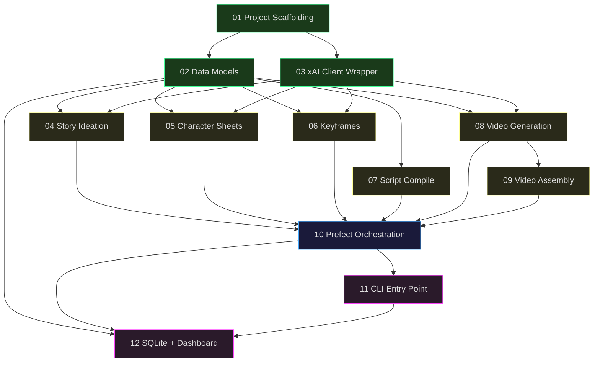

# MVP Feature Cards

Build order for the Grok Spicy video pipeline. Each card is a self-contained unit of work with clear inputs, outputs, and acceptance criteria.

## Dependency Graph



**Legend:** 🟢 Foundation — 🟡 Core Pipeline — 🔵 Integration — 🟣 Polish

```
01 Project Scaffolding
├── 02 Data Models
│   ├── 04 Story Ideation ──┐
│   ├── 05 Character Sheets ─┤
│   ├── 06 Keyframes ────────┤
│   ├── 07 Script Compile ───┤
│   └── 08 Video Generation ─┤
├── 03 xAI Client Wrapper    │
│   ├── 04 ──────────────────┤
│   ├── 05 ──────────────────┤
│   ├── 06 ──────────────────┤
│   └── 08 ──────────────────┘
09 Video Assembly ◄── 08
10 Prefect Orchestration ◄── 04-09
11 CLI Entry Point ◄── 10
12 SQLite + Dashboard ◄── 02, 10, 11
```

## Build Order

| # | Card | Layer | Key Deliverable |
|---|---|---|---|
| 01 | [Project Scaffolding](01-project-scaffolding.md) | Foundation | pyproject.toml, directory structure, stubs |
| 02 | [Data Models](02-data-models.md) | Foundation | schemas.py — all Pydantic contracts |
| 03 | [xAI Client Wrapper](03-xai-client-wrapper.md) | Foundation | client.py — SDK init, download, frame extract |
| 04 | [Story Ideation](04-story-ideation.md) | Core | Step 1 — concept → StoryPlan |
| 05 | [Character Sheets](05-character-sheets.md) | Core | Step 2 — generate + verify portraits |
| 06 | [Keyframe Composition](06-keyframe-composition.md) | Core | Step 3 — multi-image edit + vision loop |
| 07 | [Script Compilation](07-script-compilation.md) | Core | Step 4 — markdown storyboard + state.json |
| 08 | [Video Generation](08-video-generation.md) | Core | Step 5 — image→video + drift correction |
| 09 | [Video Assembly](09-video-assembly.md) | Core | Step 6 — FFmpeg normalize + concat |
| 10 | [Prefect Orchestration](10-prefect-orchestration.md) | Integration | Main flow wiring, parallelism, state |
| 11 | [CLI Entry Point](11-cli-entry-point.md) | Polish | Command-line interface |
| 12 | [SQLite + Dashboard](Feature-plan-frontend.md) | Polish | SQLite DB, FastAPI, live htmx dashboard, reference image upload |

## Suggested implementation phases

**Phase 1 — Foundation (Cards 01–03):** Get the project building, schemas defined, client wrapper working. No API calls yet.

**Phase 2 — Core Pipeline (Cards 04–09):** Build each step independently, test each in isolation. This is the bulk of the work.

**Phase 3 — Integration (Cards 10–11):** Wire everything together, add CLI. First end-to-end run.

**Phase 4 — Observability (Card 12):** SQLite persistence, FastAPI server, live-reloading htmx dashboard, reference image upload for character faces.
